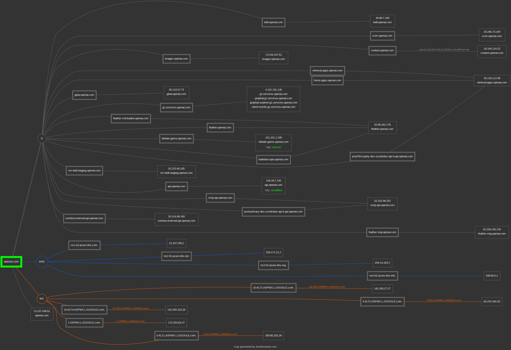

# Open Source Passive Information Gathering on OpenAI

## Table of Contents:

### [Executive Summary](#executive-summary)
### [Introduction](#1-introduction)
### [Methodology](#2-methodology)
### [Findings](#3-findings)
### [Integration and Analysis](#4-integration-and-analysis)
### [Recommendations](#5-recommendations)
### [Challenges](#6-challenges-and-lessons-learned)
### [Conclusion](#7-conclusion)

## Executive Summary:

This report aims to gather open source intelligence on OpenAI through passive information gathering techniques. The key objectives are to identify potential attack vectors and threats by examining the company's social media sentiment, key employees, technologies used, security posture, and recent news. The methodologies employed include searching public information sources, aggregating information from company websites and press releases, and analyzing social media data. The major findings from the report highlight areas of potential risk or vulnerability based on the information gathered through these passive techniques. The main vulnerability discovered was the missing security headers to prevent cross site scripting attacks. The report also examines why a strong security posture is required due to the large amount of risks and significant impact a compromise would cause.

## 1. Introduction:

### 1.1 Project Background:

OpenAI was founded in 2015 with the goal to develop safe and beneficial artificial general intelligence. They began as a non-profit organization and were committed to sharing research and patents, then they expanded with a for-profit arm of the company in 2019. Initially they were able to hire some of the top researcher in the field and greatly impacted the speed of innovation in the field.
OpenAI released GPT-1 in 2017 which introduced the concept of generative pre-trained transformers which was a major milestone in the field as the previous models required a lot of human supervision to train and well annotated data. GPT uses a mixture of initial unsupervised phase followed by a supervised "fine tuning".
In 2019 they released GPT-2 which was a 10 fold improvement over GPT-1. Notably the team at OpenAI used transfer learning to train a team of Dota 2 bots that were able to defeat the top human players in the world.
Continuing the development, GPT-3 was released in 2020 however it wasn't until they released GPT-3.5 in 2022 alongside their now notorious app ChatGPT that they were propelled into the spotlight with it quickly becoming the most widely used website in the world.
OpenAI's meteoric rise with the popularity of ChatGPT and its other models could make it a target for cyber criminals. This project will attempt to gather information about the company and its employees to identify possible attack vectors. Due to the powerful nature of the tools and services they provide coupled with the prevalence of their use it's important to examine their security posture.
The CEO Sam Altman was recently ousted from the company and reinstated 5 day later, this could be seen as instability within the company increasing its risk of being hacked. There are also growing concerns around AI safety and the potential harm these systems can inflict. Notably in a recent press release OpenAI stated that they had recently [disrupted five state affiliated malicious actor](https://openai.com/blog/disrupting-malicious-uses-of-ai-by-state-affiliated-threat-actors) from using there services to conduct cyber attacks.
While all the major tech companies have their own AIs none have been as powerful or ubiquitous as OpenAI. Every model they release seems to be far more capable and has been proven to be more effective than any other. They have the advantage of setting the pace in the field and quickly develop new models so their competitors are constantly behind.
They offer a few consumer facing apps like ChatGPT and Dall-e as well as integrations and customizable models through fine-tuning.
These products and services are used to help people learn about AI and to help them understand the potential of AI. They also help companies build AI powered software as a service or integrate it into existing apps. This funds their enormous compute requirements with some estimates of $700,000 per day of server cost.

### 1.2 Scope and Objectives:

This report aims to identify the following:
  - The company's sentiment on social media
  - The key employees of the company
  - The technologies in use by the company
  - The company's security posture
  - The company's partnerships and acquisitions
  - The company's recent news and press releases
With the objective of identifying possible attack vectors and potential threats to the company.

## 2. Methodology:

### 2.1 Data Sources:

List and describe the sources used for information gathering, including tools and platforms such as WHOIS, social media, Maltego, Shodan, and Pastebin.com.

- WHOIS: for basic DNS and hosting information
- Maltego: entity relationship mapping
- Social Searcher: Sentiment analysis
- Shodan: Infrastructure analysis
- Wikipedia
- Twitter/X
- Linked-in

### 2.2 Techniques Employed:  

- Website Reconnaissance
  - Gathered basic information about OpenAI and the services they provide.
  - Gathered information about the company's employees.
  - Identified company email format.
- WhoIS Enumeration
  - Identified Domain Name Server
  - Identified hosting provider
  - Identified registrar
  - Identified administrator
- recon-ng
  - Interesting files scan
- Shodan
  - Infrastructure analysis
- Security Header Scan
  - Identified missing security headers
- Email Harvesting
  - Attempt to identify naming conventions

### 2.3 Ethical Considerations:

This report followed the ethical framework outlined in [Ethical Frameworks in OSINT](https://www.dhs.gov/sites/default/files/2022-09/Ethical%20Frameworks%20in%20OSINT%20Final.pdf) "it is generally accepted that information gained from OSINT must be obtained in a way that does not violate existing privacy laws, must not be used in a malicious manner, and must be done only as a necessary means to an end."
All information in this report is for educational purposes only and is not intended to be used for any illegal or malicious purpose.

## 3. Findings:

### 3.1 WHOIS Analysis:

- Registration:
  - domain name: openai.com
  - Updated Date: 2023-11-30
  - Creation Date: 2007-01-19
  - Expiration Date: 2027-01-19
  - Registrant/Admin/Tech Name: REDACTED FOR PRIVACY
  - Registrar: GANDI SAS  
  - Registrar IANA ID: 81
  - Registrar Abuse Contact Email: abuse@support.gandi.net
  - Registrar Abuse Contact Phone: +33.170377661
  - Reseller: Amazon Registrar, Inc.
  - Admin/Registrant/Tech Street: 63-65 boulevard Massena
  - Admin/Registrant/Tech City: Paris
  - Admin/Registrant/Tech Postal Code: 75013
  - Admin/Registrant/Tech Country: FR
  - Admin/Registrant/Tech Phone: +33.170377666
  - Admin/Registrant/Tech Fax: +33.143730576
  - Admin/Registrant/Tech Email: c41c039c74914fac03a09f3660363355-4164038@contact.gandi.net
- Name Servers:
  - NS1-02.AZURE-DNS.COM
  - NS2-02.AZURE-DNS.NET
  - NS3-02.AZURE-DNS.ORG
  - NS4-02.AZURE-DNS.INFO

### 3.2 Social Media Insights:  

Information on important individuals:
  - Sam Altman was one of the original funders of OpenAI and has been a key contributor to the company's success. His experience at Y combinator and YC group allowed him to raise substantial capital from investors. He has also spoken to congress on the lack if AI oversight and has warned of the potential harm these systems can inflict.
  - Mira Murati has an impressive list of achievements from her work on the development of the Tesla Model X and Leap Motion to her leading the development of ChatGPT, Dall-E, and Codex.
  - Greg Brockman helped create the founding team at OpenAI and  is responsible for some of its early success by leading the development of OpenAI Five a team of Dota 2 bots that were able to defeat the top human players in the world. Often considered a modern day stockfish adding to the growing list of games that computers are better then humans at.
  - Brad Lightcap is a trusted wingman of Sam Altman and also spent time at Y combinator. He was able to secure a massive partnership with the news conglomerate Axel Springer even amidst multiple copy write lawsuits and significant bad press.
  - Ilya Sutskever is a pioneer in the field of AI research and has greatly impacted the field of deep learning. He worked at Google Brain and contributed to TensorFlow a major ML framework. He is currently working on a "Superalignment" project that aims to steer super intelligence towards human orientated goals as a means of providing AI safety. Notably he participated in the ousting of Sam Altman over concerns that AI safety was not prioritized and stepped down from the board after his reinstatement.
  - Brett Taylor is a well known entrepreneur with a long list of successes including Google Maps, Quip, Facebook, and Salesforce. He currently sits on the board of OpenAI and Shopify and recently founded a new AI startup Sierra.
  - Wojciech Zaremba interned at Nvidia, worked at Google Brain and at Facebook AI research. He is the co-creator of Chat-GPT and heads the department responsible for Github Copilot.
  - John Schulman leads the reinforcement learning team using "trial and error" to improve the GPT models. His personal website only uses http.
  - Jonathan Lachman worked for the Obama administration specializing in strategic planning and organizational scaling

- OpenAI's new text-to-video model Sora was just released and while the sentiment has been mostly positive on social media it's still a bit controversial due to its ability to spread misinformation and deep fakes. 
- There are significant spikes in followers at the release of ChatGPT and their new Sora model.

[Social Searcher](https://www.social-searcher.com/social-buzz/?q5=openAI):

[Social Blade](https://socialblade.com/search/search?query=openai):

### 3.3 Maltego Relationship Mapping:

Website entities maps:

This mapping identifies the subdomains of OpenAI and their relationships to each other. Some interesting areas for further research  could be the admin panel, platform subdomain, and chat subdomain.

### 3.4 Shodan Infrastructure Analysis:

No known vulnerabilities found using Shodan. Ports seem to be configured properly with no open ssh, telnet, or FTP ports.

Products:
- nginx
- Apache httpd
- OpenResty
- Microsoft IIS httpd

Website Titles:
- ChatGPT
- 404 Page Not Found
- Just a moment...
- 301 Moved Permanently  
- Admin Dashboard
- Camperverzekerd: Beste Camperverzekering 2024
- Document Moved
- OpenAI Platform
- OpenMeetings
- PPS
- Reading on Your Head  
- Vormats | Async video communication
- fernao magellan GmbH – Ihre digitale Sicherheit, unsere Mission

Web technologies:
- HTTP/3 
- HSTS 
- Bootstrap 
- jQuery 
- Google Tag Manager  
- jQuery CDN  
- Algolia 
- Azure Edge Network 
- Cloudflare 
- Google Analytics 
- Google Sign-in 
- PHP
- React  
- TYPO3 CMS  
- Unpkg 
- YouTube 
- cdnjs 
- jQuery UI 
- jsDelivr 
- reCAPTCHA

Ports:
443, 80, 10000, 8080, 70, 3000, 5001, 8000, 8081, 8083, 8085, 8091, 8181, 8443, 8880, 8888, 9090, 9443, 9800

Top 5 Organizations:

- Amazon Technologies Inc.
- Microsoft Corporation
- Asia Pacific Network Information Cent...
- Amazon Data Services NoVa
- Hetzner Online GmbH

### 3.5 Security Header Analysis:

Security headers are a set of metadata that can be used to detect and prevent certain types of attacks. Searching OpenAI's website revealed two missing headers one to prevent cross site scripting [Content Security Policy](https://scotthelme.co.uk/content-security-policy-an-introduction/) and [Permissions Policy](https://scotthelme.co.uk/goodbye-feature-policy-and-hello-permissions-policy/).

### 3.6 Email Harvesting with theHarvester:

Emails found:

- chris@openai.com
- damodei@openai.com
- deletion@openai.com
- dsar@openai.com
- gretchen@openai.com
- jan@openai.com
- jonas@openai.com
- sam@openai.com
- sama@openai.com
- sshoker@openai.com

Hosts found:
- blog.openai.com

## 4. Integration and Analysis:

### 4.1 Data Integration:

Utilizing the data gathered from the social media platforms, theHarvester, and Shodan, we can determine that OpenAI has good security posture. We were unable to find any vulnrablilities in their infrastructure using shodan. While we were able to find some emails with theHArvester they do not follow a common naming scheme and their were only a limited number of emails found. 
Additionally through our social media investigation we were able to determine a high technical literacy and experience among the executives. We can assume they are familiar with simple phishing techniques and more advanced methods would likely be necessary if one was to target them.
Through mapping entities with Maltego we were able to determine that OpenAI has some subdomains that might be of interest for further investigation and analysis.

### 4.2 Cross-Verification:  

Multiple tools were used to verify the findings however some may use the same API's so there maybe some overlap in the information gathered and data may not be complete. We focused on the use of free tools which may have resulted in false positives and partial analysis.

## 5. Recommendations:

Next steps could include exploring the subdomains that were found with Maltego. We would need to find the IP address of the subdomains and then use shodan to determine if they are vulnerable. We would also need to determine if they are hosting any sensitive information.
Investigating the possiblity of cross site scripting attacks could prove fruitful as it could be used to steal user information or redirect users to malicious sites.
Further research on high ranking individuals fell outside the scope of this project for ethical reasons however an attacker would not have such restrictions and their personal social media presence could provide additional attack vectors.

## 6. Challenges and Lessons Learned:

The scope of this project was potentially a little wide and made it difficult to identify specific vulnerabilities.
Many of the tools chosen overlapped in their capabilities and becoming more familiar with their strengths and weaknesses will improve tool selection and utilization.
As a first attempt at OSINT it was valuable to have hands on experience with the tools but a deeper dive into the documentation may be requires to utilize them more effectively.

## 7. Conclusion:

Overall, OpenAI has established itself as a leader in AI research and development, with transformative models that showcase the technology's potential. But balancing innovation, ethics, and oversight remains an ongoing consideration.
They have made major contributions to natural language processing through models like GPT-1, GPT-2, GPT-3, and ChatGPT.
The company operates at massive scale, with estimated computing costs of $700,000 per day.
OpenAI's leadership includes top researchers and executives with expertise in AI, business, and finance.
There are concerns around potential misuse of systems like ChatGPT. OpenAI faces challenges around responsible AI development and deployment.
While they have good security practices there has already be cases of malicious use of their systems. These do not require any hacking and use the regular capabilities of OpenAI's services to help perform cyber crimes.
Research is ongoing in this field and new methods of exploiting the underlying models or infrastructure are surly being developed.
The information gathered from this project can be used to help further research into the security posture of OpenAI adn potential improvements.
