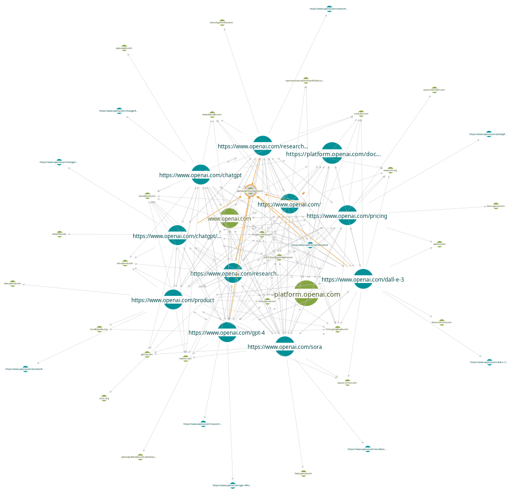

# Information Gathering Report Template

## Company Background:

- History
    - OpenAI was founded in 2015 with the goal to develop safe and beneficial artificial general intelligence. They began as a non-profit organization and were committed to sharing research and patents, then they expanded with a for-profit arm of the company in 2019. Initially they were able to hire some of the top researcher in the field and greatly impacted the speed of innovation in the field.
    
    - Key milestones or significant events:
        - OpenAI released GPT-1 in 2017 which introduced the concept of generative pre-trained transformers which was a major milestone in the field as the previous models required a lot of human supervision to train and well annotated data. GPT uses a mixture of initial unsupervised phase followed by a supervised "fine tuning".
        
        - In 2019 they released GPT-2 which was a 10 fold improvement over GPT-1. Notably the team at OpenAI used transfer learning to train a team of Dota 2 bots that were able to defeat the top human players in the world.
        
        - Continuing the development GPT-3 was released in 2020 however it wasn't until they released GPT-3.5 in 2022 alongside their now notorious app ChatGPT that they were propelled into the spotlight with it quickly becoming the most widely used website in the world.
        
- Industry:
    - They operate in the field of AI research and development with a focus on AI powered software as a service.
    
- Competitors:
    - While all the major tech companies have their own AIs none have been as powerful or ubiquitous as OpenAI. Every model they release seems to be far more capable and has been proven to be more effective than any other. They have the advantage of setting the pace in the field and quickly develop new models so their competitors are constantly behind.
    
- Products/Services:
    - They offer a few consumer facing apps like ChatGPT and Dall-e as well as integrations and customizable models through fine-tuning.
    
- Contribution to Strategy:
    - These products and services are used to help people learn about AI and to help them understand the potential of AI. They also help companies build AI powered software as a service or integrate it into existing apps. This funds their enormous compute requirements with some estimates of $700,000 per day of server cost.

## Leadership and Key Personnel:

- Key Executives:
    - Sam Altman, CEO
    - Mira Murati, CTO  
    - Greg Brockman, President & Co-Founder
    - Brad Lightcap, COO
    - Ilya Sutskever, Co-Founder and Chief Scientist  
    - Bret Taylor, Chairman of the Board
    - Wojciech Zaremba, Co-Founder
    - John Schulman, Co-Founder
    - Jonathan Lachman, Head of Special Projects

- Professional Background/Contributions:
    - Sam Altman was one of the original funders of OpenAI and has been a key contributor to the company's success. His experience at Y combinator and YC group allowed him to raise substantial capital from investors. He has also spoken to congress on the lack if AI oversight and has warned of the potential harm these systems can inflict.
    - Mira Murati has an impressive list of achievements from her work on the development of the Tesla Model X and Leap Motion to her leading the development of ChatGPT, Dall-E, and Codex.
    - Greg Brockman helped create the founding team at OpenAI and  is responsible for some of its early success by leading the development of OpenAI Five a team of Dota 2 bots that were able to defeat the top human players in the world. Often considered a modern day stockfish adding to the growing list of games that computers are better then humans at.
    - Brad Lightcap is a trusted wingman of Sam Altman and also spent time at Y combinator. He was able to secure a massive partnership with the news conglomerate Axel Springer even amidst multiple copy write lawsuits and significant bad press.
    - Ilya Sutskever is a pioneer in the field of AI research and has greatly impacted the field of deep learning. He worked at Google Brain and contributed to TensorFlow a major ML framework. He is currently working on a "Superalignment" project that aims to steer super intelligence towards human orientated goals as a means of providing AI safety. Notably he participated in the ousting of Sam Altman over concerns that AI safty was not prioratized and stepped down from the board after his reinstatement.
    - Brett Taylor is a well known entrepreneur with a long list of successes including Google Maps, Quip, Facebook, and Salesforce. He currently sits on the board of OpenAI and Shopify and recently founded a new AI startup Sierra.
    - Wojciech Zaremba interned at Nvidia, worked at Google Brain and at Facebook AI research. He is the co-creator of Chat-GPT and heads the department responsible for Github Copilot.
    - John Schulman leads the reinforcement learning team using "trial and error" to improve the GPT models. His personal website only uses http.
    - Jonathan Lachman worked for the Obama administration specializing in strategic planning and organizational scaling

# Social Media Presence: 

- Engagement:
    - TODO

- Notable Trends/Sentiments:
    - Using social searcher we determine that OpenAI has a generally positive sentiment on social media. This could be due to their recent Sora text to video model that has shocked the field once again. There has been a significant uptick in the number of posts in the past few days. This follows a general trend of initally positive reactions to openAI's releases with a reactionary turn towards the product in the weeks after. Each new release truely disrupts the field and is a major reason why they are able to keep up with the pace of the field.
    
## Recent News and Developments:

- Latest News/Press Releases:
    - TODO

- Partnerships/Mergers/Acquisitions:
    - TODO
    
## Employee Culture and Reviews:

- Company Culture:
    - TODO

- Employee Reviews:
    - TODO

# Project Title: Open Source Passive Information Gathering on OpenAI

## Executive Summary:

Provide a concise overview of the project, outlining key objectives, methodologies employed, and major findings.

## 1. Introduction:

### 1.1 Project Background:  

Briefly introduce the purpose and context of the information gathering project. Introduce the company and its leadership here as well.

  OpenAI's metoric rise with the popularity of ChatGPT and its other models could make it a taget for cyber criminals. This project will attempt to gather information about the company and its employees to identify possible attack vectors. Due to the powerful nature of the tools and services they provide coupled with the previlance of their use it's important to examine their security posture.
  The CEO Sam Altman was recently ousted from the company and reinstated 5 day later, this could be seen as instablity within the company increasing its risk of being hacked. There are also growing concerns around AI safety and the potential harm these systems can inflict. Notably in a recent press release OpenAI stated that they had recently [disrupted five state affiliated malicious actor](https://openai.com/blog/disrupting-malicious-uses-of-ai-by-state-affiliated-threat-actors) from using there services to conduct cyber attacks.

### 1.2 Scope and Objectives:

This report aims to identify the following:
  - The company's sentiment on social media
  - The key employees of the company
  - The technologies in use by the company
  - The company's security posture
  - The company's partnerships and acquisitions
  - The company's recent news and press releases
With the objective of identifying possible attack vectors and potential threats to the company.

## 2. Methodology:

### 2.1 Data Sources:

List and describe the sources used for information gathering, including tools and platforms such as WHOIS, social media, Maltego, Shodan, and Pastebin.com.

- WHOIS: for basic DNS and hosting information
- Maltego:
- Social Searcher: Sentiment analysis
- Shodan:
- recon-ng:

### 2.2 Techniques Employed:  

Detail the passive information gathering techniques applied, specifying how each tool or source was utilized.
- Website Reconnaissance
  - Gathered basic information about OpenAI and the services they provide.
  - Gathered information about the company's employees.
  - Identified company email format.
- WhoIS Enumeration
  - Identified Domain Name Server
  - Identified hosting provider
  - Identified registrar
  - Identified administrator
- Google Hacking
- recon-ng
- Shodan
- Security Header Scan
- Email Harvesting

### 2.3 Ethical Considerations:

This report followed the ethical framework outlined in [Ethical Frameworks in OSINT](https://www.dhs.gov/sites/default/files/2022-09/Ethical%20Frameworks%20in%20OSINT%20Final.pdf) "it is generally accepted that information gained from OSINT must be obtained in a way that does not violate existing privacy laws, must not be used in a malicious manner, and must be done only as a necessary means to an end."
All information in this report is for educational purposes only and is not intended to be used for any illegal or malicious purpose.

## 3. Findings:

### 3.1 WHOIS Analysis:

- Registration:
  - domain name: openai.com
  - Updated Date: 2023-11-30
  - Creation Date: 2007-01-19
  - Expiration Date: 2027-01-19
  - Registrant/Admin/Tech Name: REDACTED FOR PRIVACY
  - Registrar: GANDI SAS  
  - Registrar IANA ID: 81
  - Registrar Abuse Contact Email: abuse@support.gandi.net
  - Registrar Abuse Contact Phone: +33.170377661
  - Reseller: Amazon Registrar, Inc.
  - Admin/Registrant/Tech Street: 63-65 boulevard Massena
  - Admin/Registrant/Tech City: Paris
  - Admin/Registrant/Tech Postal Code: 75013
  - Admin/Registrant/Tech Country: FR
  - Admin/Registrant/Tech Phone: +33.170377666
  - Admin/Registrant/Tech Fax: +33.143730576
  - Admin/Registrant/Tech Email: c41c039c74914fac03a09f3660363355-4164038@contact.gandi.net
- Name Servers:
  - NS1-02.AZURE-DNS.COM
  - NS2-02.AZURE-DNS.NET
  - NS3-02.AZURE-DNS.ORG
  - NS4-02.AZURE-DNS.INFO

### 3.2 Social Media Insights:  

Present notable findings from social media platforms, focusing on public sentiment, customer interactions, and trends related to the target company.
- OpenAI's new text-to-video model Sora was just released and while the sentiment has been mostly positive on social media it's still a bit controversial due to its ablity to spread misinformation and deep fakes. 

- There are significant spikes in followers at the release of ChatGPT and their new Sora model.

[Social Searcher](https://www.social-searcher.com/social-buzz/?q5=openAI):

[Social Blade](https://socialblade.com/search/search?query=openai):

### 3.3 Maltego Relationship Mapping:

Visualize and discuss relationships between entities associated with the target company, using Maltego for entity relationship mapping. 
Website entities map:

### 3.4 Shodan Infrastructure Analysis:

Highlight information obtained from Shodan related to the target company's internet-facing infrastructure, emphasizing security-related insights.

No known vulnerabilities found using Shodan. Ports seem to be configured properly with no open ssh, telnet, or FTP ports.

Products:
- nginx
- Apache httpd
- OpenResty
- Microsoft IIS httpd

Website Titles:
- ChatGPT
- 404 Page Not Found
- Just a moment...
- 301 Moved Permanently  
- Admin Dashboard
- Camperverzekerd: Beste Camperverzekering 2024
- Document Moved
- OpenAI Platform
- OpenMeetings
- PPS
- Reading on Your Head  
- Vormats | Async video communication
- fernao magellan GmbH – Ihre digitale Sicherheit, unsere Mission

Web technologies:
- HTTP/3 
- HSTS 
- Bootstrap 
- jQuery 
- Google Tag Manager  
- jQuery CDN  
- Algolia 
- Azure Edge Network 
- Cloudflare 
- Google Analytics 
- Google Sign-in 
- PHP 
- React  
- TYPO3 CMS  
- Unpkg 
- YouTube 
- cdnjs 
- jQuery UI 
- jsDelivr 
- reCAPTCHA

Ports :
443, 80, 10000, 8080, 70, 3000, 5001, 8000, 8081, 8083, 8085, 8091, 8181, 8443, 8880, 8888, 9090, 9443, 9800

Top 5 Organization:

- Amazon Technologies Inc.
- Microsoft Corporation
- Asia Pacific Network Information Cent...
- Amazon Data Services NoVa
- Hetzner Online GmbH

### 3.5 Security Header Analysis:

Security headers are a set of metadata that can be used to detect and prevent certain types of attacks. Searching OpenAI's website revealed two missing headers one to prevent cross site scripting [Content Security Policy](https://scotthelme.co.uk/content-security-policy-an-introduction/) and [Permissions Policy](https://scotthelme.co.uk/goodbye-feature-policy-and-hello-permissions-policy/).

## 4. Integration and Analysis:

### 4.1 Data Integration:

Explain how data from various sources was integrated to create a comprehensive profile of the target company.

### 4.2 Cross-Verification:  

Discuss efforts made to cross-verify information, addressing any discrepancies and ensuring data accuracy.

## 5. Recommendations:

Provide recommendations based on the insights gained, suggesting actions or further areas of investigation.

## 6. Challenges and Lessons Learned:

Reflect on challenges encountered during the information gathering process and outline lessons learned for future projects. 

## 7. Conclusion:

Summarize key findings and the overall impact of the information gathering effort on the project.
