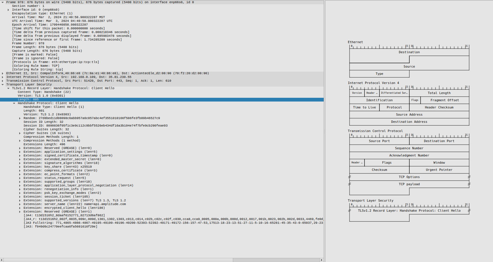
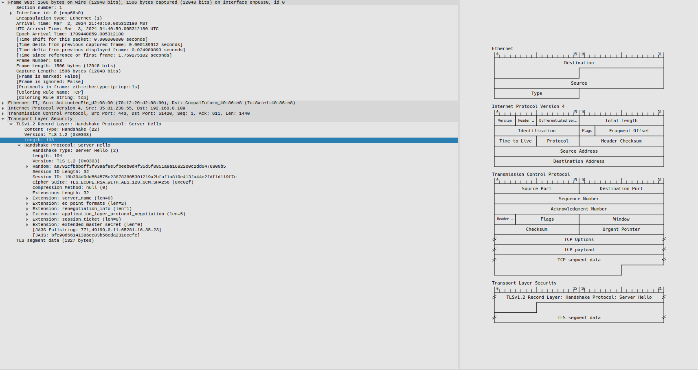
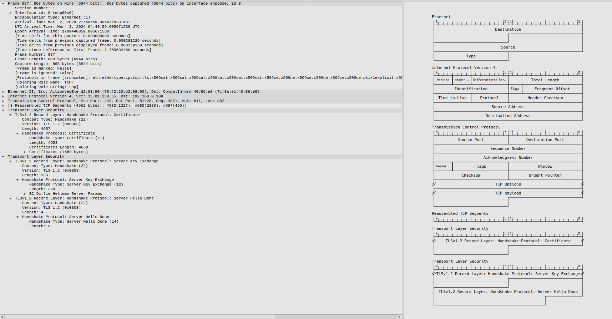
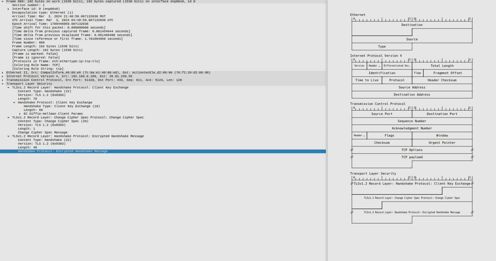
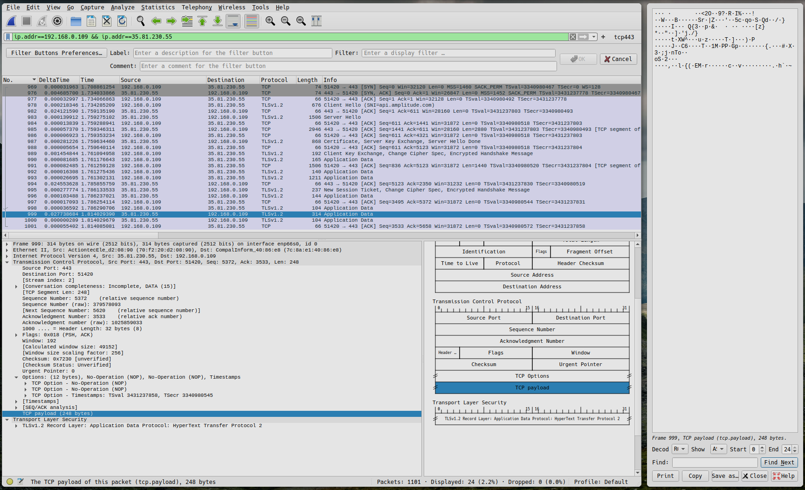

# Encryption Report

## Table of Contents

- [Introduction](#introduction)
- [Methodology](#methodology)
- [TLS Handshake Analysis](#tls-handshake-analysis)
- [Packet Details](#packet-details)

## Introduction

The objective of this report is to share the timestamp and details of the ClientHello, ServerHello, and the Key Exchange messages exchanged during the TLS handshake. It will explain the purpose and significance of each message in the TLS handshake process. The report will also identify the source and destination IP addresses and port numbers for each packet in the handshake. Finally, it will confirm that packets are encrypted after the handshake is completed.

## Methodology

### A. Tools Used

- Wireshark

### B. Procedure followed

- Start Wireshark capture
- Filter on TLS handshake
- Identify ClientHello, ServerHello, and Key Exchange packets
- Examine packets to extract relevant information

## TLS Handshake Analysis

### ClientHello Message

#### Purpose and Significance

- Initiates the TLS handshake by the client
- Proposes options for establishing the secure session:
- Contains a client random value used for key derivation and preventing replay attacks
- Allows server to select appropriate TLS options (version, ciphers, etc) supported by both parties
- Key exchange cannot begin until ServerHello is sent in response
- ClientHello must be the first message sent by client to negotiate TLS session

### ServerHello Message

#### Purpose and Significance

- Confirms the version of TLS that will be used based on the options presented by the client.
- Chooses the cipher suite that will be used to encrypt data based on the client's options.
- Provides a random nonce value that will be used to derive symmetric keys.
- Indicates the server's chosen compression method from the client's options.
- Provides the server's certificate if certificate-based authentication is being used.

### Key Exchange Message

#### Purpose and Significance

- Allows client and server to securely share cryptographic key material
- Prevents encryption keys from being exposed on the network
- Enables derivation of symmetric keys used to encrypt session data
- Shared secret is used to derive symmetric encryption keys
- Prevents attackers from obtaining keys protecting session

## Packet Details

### A. Source and Destination Information

#### ClientHello Packet

- Source IP: 192.168.0.109
- Source Port: 51420
- Destination IP: 35.81.230.55
- Destination Port: 443

#### ServerHello Packet

- Source IP: 35.81.230.55
- Source Port: 443
- Destination IP: 192.168.0.109
- Destination Port: 51420

#### Key Exchange Packet

- Source IP: 35.81.230.55
- Source Port: 443
- Destination IP:192.168.0.109
- Destination Port: 51420

### B. Encryption Verification

