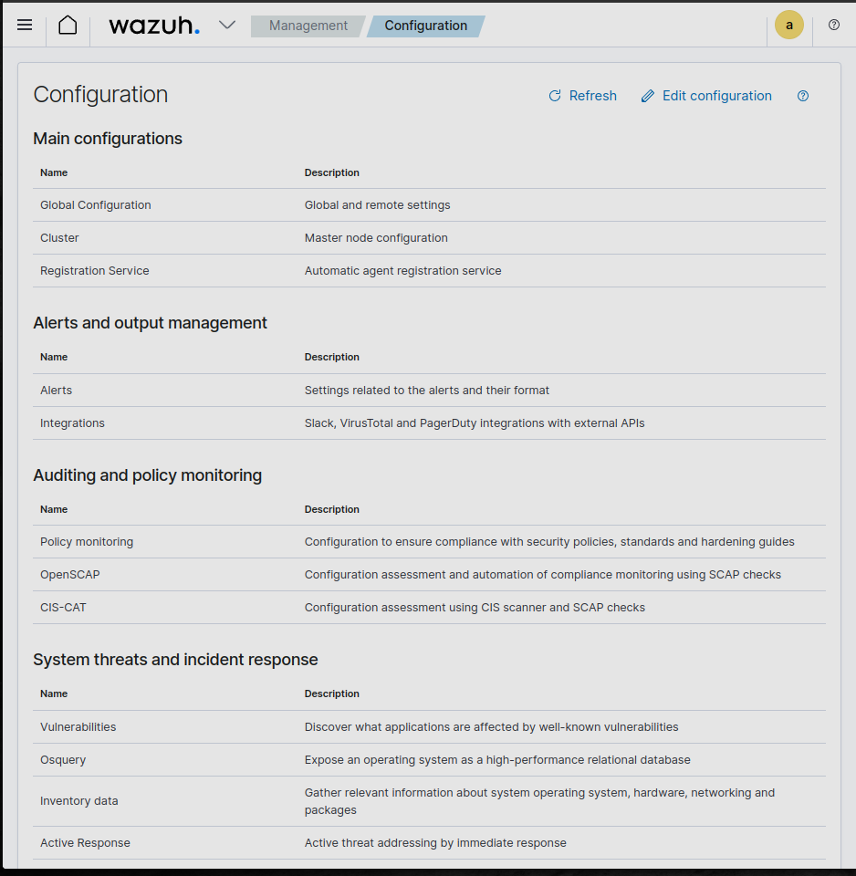
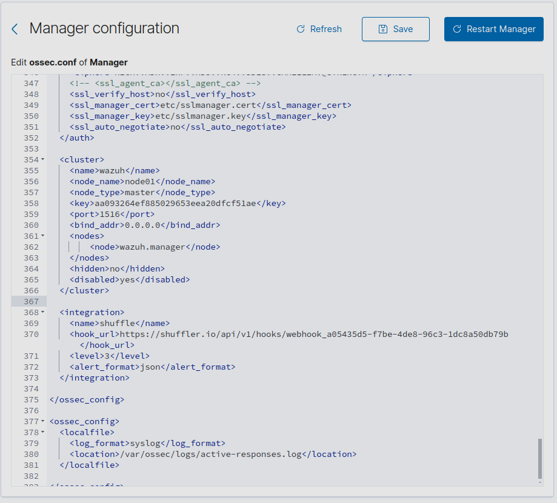
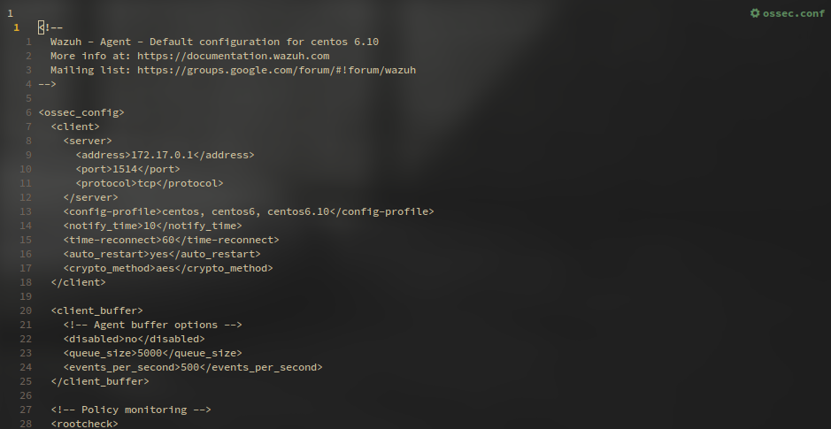
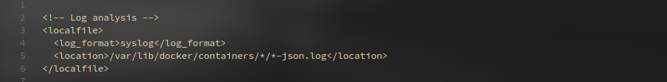
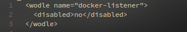
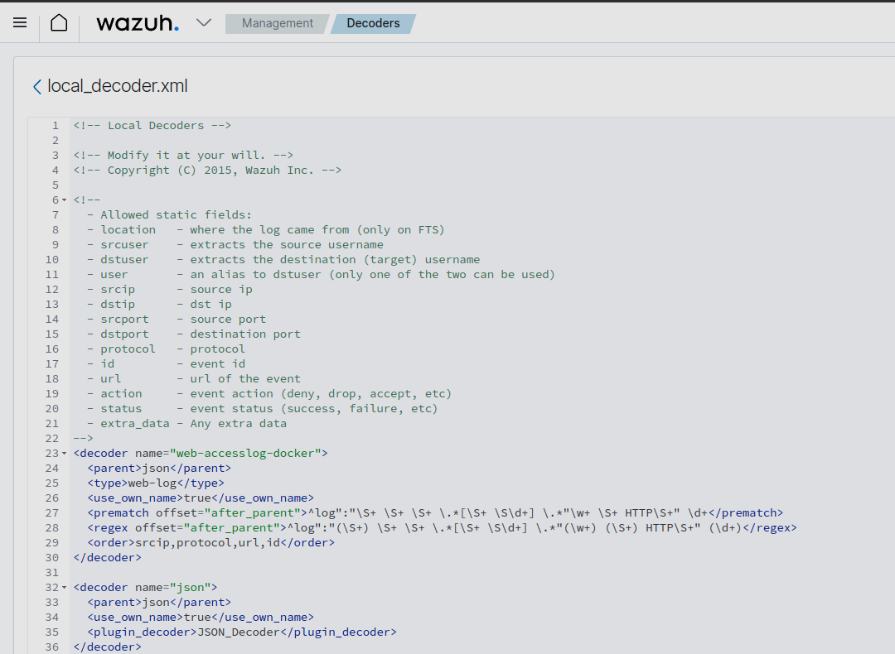
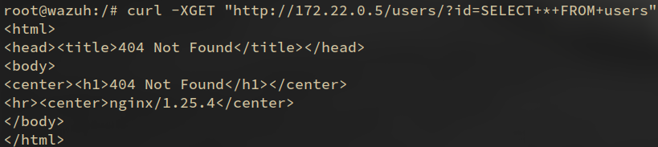
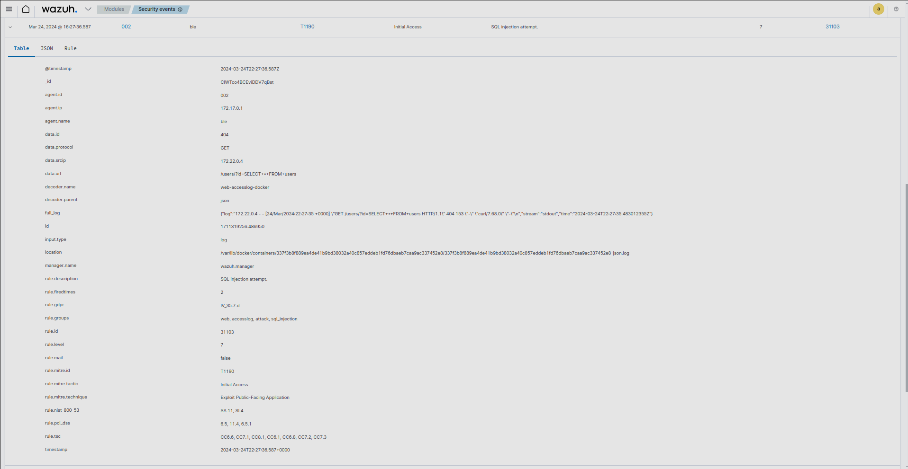
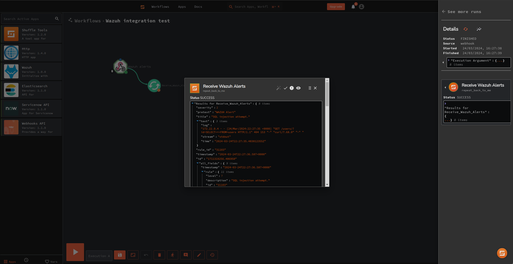

# SOC & Automation Report

## Table of Contents

- [Overview of the Selected IOC](#overview-of-the-selected-ioc)
  - [Introduction](#introduction)
  - [Key Characteristics](#key-characteristics)
- [Setting up Wazuh and Creating a Rule](#setting-up-wazuh-and-creating-a-rule)
  - [Installation and Configuration](#installation-and-configuration)
  - [Rule Creation](#rule-creation)
- [Shuffler.io Configuration for Automated Response](#shufflerio-configuration-for-automated-response)
  - [Integration with Wazuh](#integration-with-wazuh)
  - [Automated Response Setup](#automated-response-setup)
- [Results and Observations from Threat Simulation](#results-and-observations-from-threat-simulation)
  - [Threat Simulation Scenario](#threat-simulation-scenario)
  - [Detection and Response](#detection-and-response)
  - [Observations and Improvements](#observations-and-improvements)
- [Conclusion](#conclusion)

## Overview of the Selected IOC

### Introduction

SQL injection is one of the most common types of threats in the world. It is a common technique used to manipulate data in databases. Attackers use SQL injection to send malicious SQL statements to the database via web page input fields in order to retrieve, modify or delete information. This can allow attackers to gain unauthorized access to sensitive data or perform other malicious actions. Defending against SQL injection requires proper input validation and parameterized queries. This relies on developers using secure coding practices, implementing input validation frameworks, and scan for SQL injection flaws. Given its prevalence, organizations should prioritize SQL injection vulnerabilities in their vulnerability management programs. Additionally, monitoring for SQL injection attempts can further protect an organization by providing automated alerting and mitigation.

### Key Characteristics

SQL injection attacks involve inserting malicious SQL statements into an entry field for execution by the underlying database. The attacker crafts the SQL statement to manipulate or extract data they should not have access to.

Common injection points are web forms, URL parameters, and HTTP headers. The injected query can read/write/modify/delete information in the database, execute admin commands, or potentially access OS files.

## Setting up Wazuh and Creating a Rule

### Installation and Configuration

- Following the steps outlined in the alternative installations documentation, wazuh was set up as a set of docker containers.
  - First clone the wazuh-docker git repository.
    - `git clone https://github.com/wazuh/wazuh-docker.git`
  - Next install docker and docker compose using our systems package manager (pacman for Arch and apt for debian).
    - `sudo pacman -S docker docker-compose`
  - Additionally increase max memory mapped areas.
    - `sudo sysctl -w vm.max_map_count=262144`
  - Navigate to the cloned repository and locate the single-node directory.
    - `cd wazuh-docker/single-node`
  - Use the provided certificate generator to generate the certificates for the wazuh containers.
    - `docker-compose -f generate-indexer-certs.yml run --rm generator`
  - Now the wazuh containers can be started with docker-compose.
    - `docker-compose up` or `docker-compose up -d` (to run in background)
  - Finally configure the wazuh manager using the web interface now accessible at https://localhost.

### Rule Creation

- While exploring multiple custom rules to detect malicious domains a lack of experience and knowledge made testing these rules difficult. Here are some of the custom rules tested however it was difficult to find what may be causing the rule to fail to trigger. Testing multiple variations of these rules had no noticeable effect and lack of understanding made it difficult to troubleshoot.

```xml
  <rule id="100003" level="5">
    <category>syslog</category>
    <match>hydeoutent\.com</match>
    <description>IOC detected for domain hydeoutent.com</description>
  </rule>
<group name="network_traffic">
  <rule id="100002" level="5">
    <match>mainserver\.com</match>
    <description>Suspicious domain found:</description>
    <group>network_traffic, pentest</group>
  </rule>
</group>
```

- After writing the rule and accessing the wazuh manager multiple attempts were made to trigger the rule including, adding the malicious domain to the /etc/hosts file and attempting to curl the domain in order to trigger the detection. However the rule was not detected and after many hours of troubleshooting no rules were triggered including the default rules. In an effort to simplify the variables a pre-built rule was chosen and modifications were made to the test environment.
- This lead us to the approach of this report in an attempt to demonstrate a working shuffler.io integration and container monitoring.
- This rule triggers when a URL containing SQL keywords is detected signaling an injection attempt.

```xml
  <rule id="31164" level="6">
    <if_sid>31100</if_sid>
    <url>=%27|select%2B|insert%2B|%2Bfrom%2B|%2Bwhere%2B|%2Bunion%2B</url>
    <description>SQL injection attempt.</description>
    <mitre>
      <id>T1055</id>
      <id>T1190</id>
    </mitre>
    <group>attack,sqlinjection,attack,pci_dss_6.5,pci_dss_11.4,pci_dss_6.5.1,gdpr_IV_35.7.d,nist_800_53_SA.11,nist_800_53_SI.4,tsc_CC6.6,tsc_CC7.1,tsc_CC8.1,tsc_CC6.1,tsc_CC6.8,tsc_CC7.2,tsc_CC7.3,</group>
  </rule>
```

## Shuffler.io Configuration for Automated Response

### Integration with Wazuh

- Navigate to the Management/configuration page and edit the configuration file.

  

- Add the shuffler.io integration to the ossec.conf file.

  

  > **_NOTE:_** Utilizing the Wazuh web dashboard we were able to add the shuffler.io integration to the ossec.conf file. When using the dashboard to restart the manager everything behaved normally. However if the Docker containers are restarted the changes are lost. May be the result of missing volume mounts or conflicts with running agent on host.

### Automated Response Setup

Setup a web hook for shuffler.io to listen for the response from the Wazuh server and specified the call attribute $exec in order to accept execution arguments. Use this web hook URI in the shuffle integration in the wazuh server. Then check the runs to see if there is a response when the Wazuh server restarted or an alert was triggered.

## Results and Observations from Threat Simulation

### Threat Simulation Scenario

Describe the specific threat scenario simulated for testing the integration of Wazuh and Shuffler.io.

- In order to create a threat simulation install the wazuh agent on host computer utilizing the Arch User Repository (AUR)

- `yay -S wazuh-agent`

- Next the agent is configured to use the wazuh manager by modifying the ossec.conf file to include the wazuh manager ip address.

- `sudo vim /var/ossec/etc/ossec.conf`



- Add the docker logs to the ossec.conf file and enable the docker-listener





- On the wazuh server add a custom decoder to parse the docker logs and create a json file.



- Now create a new docker container of a base nginx image and deploy it on the wazuh servers network
  - `docker run --name test --network single-node_default -p 80:80 -d nginx`
- Obtain the ip address of the web server with the following command
  - `docker inspect test | grep IPAddress`
- Next access the wazuh manager shell
  - `docker exec -it single-node-wazuh.manager-1 bash`
- From here attempt an SQL Injection on the test web server
  - `curl -XGET "http://172.22.0.5/users/?id=SELECT+*+FROM+users"`



### Detection and Response

- The server responds with 404 as there is no sql configured however an alert is raised in the wazuh dashboard.



- Also check out the shuffler.io integration working as it forwards the alert from the webhook



### Observations and Improvements

We faced many challenges in the simulation and spent a majority of the time troubleshooting and assisting our colleges. The initial setup with docker went smoothly and we were confident that configuring rules and integrations would be relatively. Once we had identified the IOC using alienvault we attempted to write a rule that detected if a malicious domain was being accessed. When it came to injecting the IOC to simulate the treat we lacked the confidence to do so without compromising our host machine. We attempted to use the wazuh agent to inject the IOC but it was not working as expected and our additional research did not provide any fruitful insights. As a last resort we configured container monitoring and deployed a basic web server. We were able to then simulate an SQL injection on the web server which finally resulted in an alert. These challenges inhibited our ability to further investigate our shuffler workflow and we were only able to complete a basic proof of concept.

## Conclusion

This remains an area for further research and improvement. Though the project we identified critical gaps in understanding of the tools and their various components. The automation pipeline also requires further investigation to understand how to optimize responses and integrate more services. There were important lessons learned in how to setup a test environment and further research could help in setting up a fully functional home lab. While the tools are powerful they require a deeper understanding to be used effectively.
