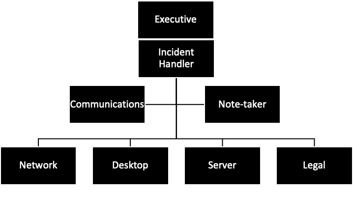

# Spendology Solutions

# Incident Response Plan

## Table of Contents

- [REVISION HISTORY](#revision-history)
- [TESTING & REVIEW CYCLE](#testing--review-cycle)
- [PURPOSE & SCOPE](#purpose--scope)
  - [PURPOSE](#purpose)
  - [SCOPE](#scope)
- [AUTHORITY](#authority)
- [DEFINITIONS](#definitions)
- [HOW TO RECOGNIZE A CYBER INCIDENT](#how-to-recognize-a-cyber-incident)
- [CYBER SECURITY INCIDENT RESPONSE TEAM (CSIRT)](#cyber-security-incident-response-team-csirt)
  - [CSIRT STRUCTURE](#csirt-structure)
  - [CSIRT ROLES](#csirt-roles)
  - [CSIRT RESPONSIBILITIES](#csirt-responsibilities)
- [CONTACT INFORMATION](#contact-information)
  - [CSIRT CONTACTS](#csirt-contacts)
  - [EXTERNAL CONTACTS](#external-contacts)
  - [OTHER STAKEHOLDER CONTACTS](#other-stakeholder-contacts)
- [INCIDENT TYPES](#incident-types)
- [INCIDENT SEVERITY MATRIX](#incident-severity-matrix)
- [INCIDENT HANDLING PROCESS](#incident-handling-process)
  - [INCIDENT HANDLING PROCESS OVERVIEW](#incident-handling-process-overview)
  - [INCIDENT SPECIFIC HANDLING PROCESSES](#incident-specific-handling-processes)
    - [DATA BREACH](#data-breach)
    - [RANSOMWARE](#ransomware)
    - [TAMPERING OF PAYMENT TERMINALS](#tampering-of-payment-terminals)
    - [WIDESPREAD SERVICE INTERRUPTION](#widespread-service-interruption)
    - [LOSS OF EQUIPMENT](#loss-of-equipment)
- [APPROVALS](#approvals)
  - [RESPONSIBLE PARTY](#responsible-party)
  - [INCIDENT HANDLER](#incident-handler)
- [REFERENCES](#references)

# REVISION HISTORY

| Date    | Version    | Modification    | Modifier    |
|---|---|---|---|
| 2024-03-28 | 0.0.1 | templating | Liam Dodd |

# TESTING & REVIEW CYCLE

> \[!NOTE\]
> Instructions: Determine how often your Cyber Security Incident Response Plan
> will be tested and how often reviews are required (Bi-annually, annually,
> etc.). At a minimum, an incident response plan should be reviewed & updated
> at least once every three years. Testing frequency is at an organization’s
> discretion. Determine and document the process to test and review your Cyber
> Security Incident response plan. If appropriate to your organization, the
> example provided below can be used.

Bi-annual testing of the Incident Response Plan is
necessary to ensure the CSIRT (Cyber Security Incident Response Team) is
aware of its obligations. Unless real incidents occur, which test the full
functionality of the process, this can be achieved using walkthroughs and
practical simulations of potential incidents.

1. The Incident Response Plan will be tested at least once biannually.
1. The Incident Response Plan Testing will test your business response to potential incidents, identifying process gaps and improvement areas.
1. The CSIRT will record observations made during the testing, such as steps that were poorly executed or misunderstood by participants and aspects that need improvement.
1. The Incident Handler will ensure the Security Incident Response Plan is updated and distributed to CSIRT members.

# PURPOSE & SCOPE

## PURPOSE

> \[!NOTE\]
> Instructions: Describe the purpose of your organization’s Incident Response Plan. If appropriate to your organization, the example provided below can be used.

This Incident Response Plan exists to ensure Spendology Solutions is
prepared to manage cyber incidents in an effective and efficient manner. Cyber
security incidents are more frequent and sophisticated than ever. No
organization globally is immune to attack. Organizations must ensure they are
prepared to detect, prevent, and respond to incidents. By having a plan, a
team, and conducting exercises, we will be better prepared to respond
inevitable incidents. In addition, we will be able to contain the damage and
mitigate further risk to the organization. Resources must be deployed in an
organized fashion with exercised skills and communication strategies. This
document describes the overall plan for responding to Cyber Security Incidents
at Spendology Solutions. It identifies the structure, roles and
responsibilities, types of common incidents, and the approach to preparing,
identifying, containing, eradicating, recovering, and conducting lessons
learned in order to minimize the impact of cyber security incidents. The goal
of the Incident Response Plan is to ensure Spendology Solutions is
organized to respond to cyber security incidents effectively and efficiently.

## SCOPE

> \[!NOTE\]
> Instructions: Determine the scope of your plan, including all affected systems and stakeholders. You can refer to the example below and if appropriate, modify the scope as appropriate to your organization.

This Incident Response Plan applies to our networks, systems, and data, and
stakeholders (for example, employees, contractors, 3rd party vendors) that
access them. Members of the organization who are part of the Cyber Security
Incident Response Team (CSIRT) are expected to lead or participate in a cyber
incidence response. CSIRT members must familiarize themselves with this plan
and be prepared to collaborate, with the goal of minimizing adverse effects on
the organization.

This document establishes incident handling and incident response capabilities
and determines the appropriate response for common cyber security incidents.
This document is not intended to provide a detailed list of all activities that
should be performed in combatting cyber security incidents.

# AUTHORITY

> \[!NOTE\]
> Instructions: Identify and document the individuals/role in your organization
> that will be responsible for handling an incident.

Responsibility for the security of company and customer information resides
with the President/Owner. During times when a high or critical cyber security
incident is underway, this responsibility is entrusted to the General Manager.

# DEFINITIONS

> \[!NOTE\]
> Instructions: Review the definitions below and retain or revise as required.
> If necessary, expand the list to best reflect your organization’s unique
> Cyber Security Incident Response Plan.

| Term | Description |
| --- | --- |
| Acceptable interruption window | In business continuity planning, is the amount of time in which basic functionality must be restored for critical systems. It is a major factor when planning a disaster recovery solution. |
| Confidentiality | Is a classification of data that typically refers to personally identifiable information. It may include such things as social insurance numbers, driver's license numbers, etc. |
| Cyber Security Event | Is an observable occurrence in a system or network. Events include a user connecting to a file share, a server receiving a request for a web page, or a user sending email. |
| Cyber Security Incident | Is any incident that occurs by accident or deliberately that impacts communications or information processing systems. An incident may be any event or set of circumstances that threatens the confidentiality, integrity, or availability of information, data, or services within \[Organization Name\]. This includes unauthorized access to, use, disclosure, modification, or destruction of data or services used or provided by \[Organization Name\]. |
| Denial of Service (attack) | Also known as a DoS attack, seeks to make a remote service unavailable to its intended users by flooding its host with superfluous requests, thereby overloading the system. |
| Exploit | In cybersecurity terms is a piece of software, a chunk of data, or a sequence of commands that takes advantage of a bug or vulnerability to cause unintended or unanticipated behavior to occur on computer software, hardware, or something electronic. |
| Indicators | Also known as "Indicators of Compromise" or IOCs, are forensic clues or symptoms left behind by cybersecurity attacks or breaches in the company's network or systems. These clues are sometimes found in log entries, files, or databases. |
| Integrity | Refers to the maintenance or assurance of data accuracy, consistency, and its accessibility to authorized users for its entire life-cycle. |
| Maximum tolerable downtime | In business continuity planning, this specifies the maximum period of time that a given business process can be inoperative before the organization's survival is at risk. |
| Response playbook | Introduces prescriptive cybersecurity measures and best practices that can be implemented to improve the organization's security profile. This playbook provides a set of standards to reference the organization, improves current systems, and implement new ones. |
| Service availability | Describes the state of a system being available and responsive to prospective users. The term is sometimes used to reference a measure of reliability of a system or network resource based on how often it is available as a % of time. For example, 99.97% service availability means that a system is available 99.97% of the time. |
| SLA | Stands for service level agreement and is used to describe a guaranteed measure of service availability. If service availability drops below the prescribed SLA, there are usually financial repercussions, like a money-back guarantee. |
| Stakeholder relationship map | Is a diagram that describes the relationship between individuals in an organization. With respect to cybersecurity, these diagrams are used to perform IT risk assessments to better inform preventative and reactive measures. |
| Vulnerability | Is a piece of code or bug within a system that causes unintended or unanticipated behavior. A vulnerability implies that this behavior can be taken advantage of for malicious reasons. |
| War room | Is a dedicated meeting room where major incidents are handled together. It must have a door for privacy, must be available at all times, and must have good communications infrastructure (network, phone, etc.). |
| Zero-day | Is a type of vulnerability that is known to the software vendor but doesn't have a patch in place to fix the flaw. It has at least the potential to be exploited, if it has not already been exploited by cybercriminals. |

# HOW TO RECOGNIZE A CYBER INCIDENT

> \[!NOTE\]
> Instructions: Review and retain the indicators that are applicable to your organization. Expand the list of indicators as appropriate to your organization.

A cyber security incident may not be recognized straightaway; however, there may be indicators of a security breach, system compromise, unauthorized activity, or signs of misuse within your environment, or that of your third-party service providers.

1. Look out for any indication that a security incident has occurred or may be in progress. Some of these are outlined below:
1. Excessive or unusual log-in and system activity, in particular from any inactive user IDs (user accounts)
1. Excessive or unusual remote access activity into your business. This could relate to staff or third-party providers
1. The occurrence of any new wireless (Wi-Fi) networks visible or accessible from your environment
1. The presence of or unusual activity in relation to malware (malicious software), suspicious files, or new/unapproved executable files and programs. This could be on your networks or systems, including web-facing systems
1. Hardware or software key-loggers found connected to or installed on systems
1. Suspicious or unusual activity on, or behavior of web-facing systems, such on as e-commerce websites
1. Point-of-Sale (POS) payment devices, payment terminals, chip & PIN/signature devices, or dip/swipe card readers showing signs of tampering
1. Any card-skimming devices found in your business
1. Lost, stolen, or misplaced merchant copy receipts or any other records that display a full payment card number or card security code (the three- or four-digit number printed on the card)
1. Lost, stolen, or misplaced computers, laptops, hard drives, or other media devices that contain payment card data or other sensitive data

# CYBER SECURITY INCIDENT RESPONSE TEAM (CSIRT)

## CSIRT STRUCTURE

> \[!NOTE\]
> Instructions: Provide the organization structure of your CSIRT Team. At a minimum, it must contain an Executive, an Incident Handler and a communication spokesperson as outlined in the common structure below.

<figure>
  <figcaption>Common structure of a Cyber Security Incident Response Team (CSIRT).</figcaption>
   
  
</figure>

## CSIRT ROLES

> \[!NOTE\]
> Instructions:
> Define the roles and responsibilities, and provide the respective contact information for each member of the CSIRT in the provided space. A table is provided with examples of best practices
> Each role should have a secondary and often a tertiary alternative identified
> Some CSIRT roles may be fulfilled by third part vendors or contracted individuals
> Note, the Incident Handler is not usually the company President/CEO, but rather the head of an IT Team. For organizations that do not have dedicated IT personnel, the President/CEO can assume the role
> List key external contacts and stakeholders that you may need to contact during an incident (for example, legal representative, financial insertions, key clients, staff, IT provider, etc)

| Role | Definition |
| --- | --- |
| Executive | Accountable Executive for protecting cyber security within the organization. Responsible for reporting to board directors and other executives. Within the CSIRT, this role is responsible for all issues requiring executive decision. |
| Incident Handler | The Incident Handler is the main triage role of the CSIRT. This role organizes the team and initiates the Incident Response Plan to investigate and respond to cyber security incidents. |
| Communications | The Communications Expert is responsible for both public relations and internal communications. They are the messenger to ensure that internal/external stakeholders, customers, and the public are informed in a timely and compliant fashion. |
| Note-Taker | |
| Network Technician | |
| Desktop Technician | |
| Server Technician | |
| Legal Technician | |

# CSIRT RESPONSIBILITIES

The responsibilities described below are organized by role within Spendology Solutions.

**EXECUTIVES**

The Executives are/is responsible for:

1. Providing strategic guidance and support for the CSIRT
1. Allocating adequate resources and budget for the CSIRT to operate effectively
1. Empowering the CSIRT to take necessary actions during incidents
1. Reviewing and approving incident response policies and procedures
1. Receiving reports and briefings on major incidents
1. Authorizing communications about incidents to customers, partners, and public

**INCIDENT HANDLER**

The Incident Handler is responsible for:

1. Leading the investigation and remediation of security incidents
1. Assessing and containing incidents to prevent further damage
1. Collecting and preserving evidence from affected systems
1. Documenting details about incidents for post-mortem analysis
1. Suggesting improvements to security controls and policies
1. Maintaining and enhancing incident response skills through training

**COMMUNICATIONS EXPERT**

The communications expert is responsible for:

1. Developing internal and external communications plans for incident response
1. Drafting notifications, status updates, and reports to various stakeholders
1. Reviewing and approving any communications about incidents before they are sent
1. Interfacing with PR and legal teams to ensure coordinated messaging
1. Managing inquiries from media, customers, partners, and other external parties
1. Educating employees on policies for communications during incidents

**CSIRT TEAM**

Cyber Security Incident Response Team (CSIRT) members are responsible for:

1. Detecting, analyzing, and responding to cybersecurity incidents
1. Conducting forensic investigation and remediation of incidents
1. Improving security controls to prevent or limit future incidents
1. Creating and refining incident response plans, policies, and procedures
1. Maintaining skills and knowledge of latest threats, tools, and response tactics

**All staff members are responsible for:**

1. Reporting suspected incidents and vulnerabilities to the CSIRT
1. Complying with incident response and communications policies
1. Assisting the CSIRT as needed during investigations and mitigation
1. Participating in incident response training and exercises
1. Safeguarding sensitive data and protecting systems/accounts
   The responsibilities described below are organized by role within Spendology Solutions.

# CONTACT INFORMATION

## CSIRT CONTACTS

| CSIRT Role | Name | Title | Phone | Email |
|------------|------|-------|-------|-------|
| Incident Handler (lead) | John Smith | 555-123-4567 | john.smith@spendology.com |\
| Incident Handler (backup) | Jane Doe | 555-987-6543 | jane.doe@spendology.com |
| Note-taker | Bob Johnson | 555-456-7890 | bob.johnson@spendology.com |\
| Communications | Sarah Lee | 555-234-5678 | sarah.lee@spendology.com |
| Network | Mike Davis | 555-345-6789 | mike.davis@spendology.com |
| Desktop | Jessica Wong | 555-567-8901 | jessica.wong@spendology.com |
| Server | David Kim | 555-678-9012 | david.kim@spendology.com |
| Legal | Amy Green | 555-789-0123 | amy.green@spendology.com |
| Executive | Chris Brown | 555-890-1234 | chris.brown@spendology.com |

## EXTERNAL CONTACTS

| Role | Organization | Name | Title | Phone | Email |
|------|--------------|------|-------|-------|-------|
| Investor | Sequoia Capital | John Doe | General Partner | 555-123-4567 | jdoe@sequoiacap.com |
| Vendor | Acme Co. | Jane Smith | CEO | 555-987-6543 | jsmith@acme.com |\
| Vendor | ABC Solutions | Bob Johnson | Sales Manager | 555-456-1234 | bjohnson@abcsolutions.com |

## OTHER STAKEHOLDER CONTACTS

| Role | Organization | Name | Title | Phone | Email |
|------|--------------|------|-------|-------|-------|
| Investor | Acme Venture Capital | John Doe | Managing Partner | 555-123-4567 | jdoe@acmevc.com |
| Customer | XYZ Corp | Jane Smith | CEO | 555-987-6543 | jsmith@xyzcorp.com |\
| Partner | 123 Partners | Bob Johnson | President | 555-456-7890 | bjohnson@123partners.com |

# INCIDENT TYPES

> \[!NOTE\]
> Instructions: Review the incidents listed below and their description to determine which are appropriate to be included in your Plan. The types can be expanded as necessary.

| Type | Description |
|------|-------------|
| Unauthorized Access or Usage | Individual gains physical or logical access to network, system, or data without permission. |
| Service Interruption or Denial of Service | Attack that prevents access to the service or otherwise impairs normal operation. |
| Malicious Code | Installation of malicious software (for example, virus, worm, Trojan, or other code). |
| Ransomware | A specific type of malicious code that infects a computer and displays messages demanding a fee be paid in order for the system to work again. |
| Distributed Denial of Service (DDoS) | Distributed denial-of-service attacks target websites and online services. The aim is to overwhelm them with more traffic than the server or network can accommodate. The goal is to render the website or service inoperable. Symptoms are widespread connectivity failures or system unavailable errors. |
| Network System Failures (widespread) | An incident affecting the confidentiality, integrity, or availability of networks. |
| Application System Failures | An incident affecting the confidentiality, integrity, or availability of applications or systems. |
| Unauthorized Disclosure or Loss of Information | An incident affecting the confidentiality, integrity, or availability of data. |
| Privacy Breach | An incident that involves real or suspected loss of personal information. |
| Information Security/Data Breach | An incident that involves real or suspected loss of sensitive information. |
| Account Data Compromise | A data breach incident specific to payment card data. Such events result in unauthorized access to or exposure of payment card data (cardholder data or sensitive authentication data). |
| Other | Any other incident that affects networks, systems, or data. |

# INCIDENT SEVERITY MATRIX

> \[!NOTE\]
> Instructions: Review the sample best practice process below to determine if applicable for your organization’s. Revise to align with your organization.

The CSIRT will determine the severity of the incident. They will consider:

1. whether a single system is affected or multiple
1. the criticality of the system(s) affected
1. whether impacting a single person or multiple
1. whether impacting a single team/department, multiple teams/departments, or the entire organization

The Incident Handler must consider the relevant business context and what else is happening with the business at the time to fully understand the impacts and urgency of remedial action.

The CSIRT will consider the available information to determine the known magnitude of impact compared with the estimated size, along with likelihood of the effect spreading and the potential pace of such spread. The CSIRT will determine the potential impacts to the organization, including financial damage, brand and reputational damage, and other types of harm. The incident may be the result of a sophisticated or unsophisticated threat, an automated or manual attack, or may be nuisance/vandalism. The CSIRT will determine:

1. whether there is evidence of the vulnerability being exploited
1. whether there is a known patch
1. whether this is a new threat (for example, zero day) or a known threat
1. the estimated effort to contain the problem

<table class="color">
<tr>
<th>Category</th>
<th>Indicators</th> 
<th>Scope</th>
<th>Action</th>
</tr>

<tr style="background-color:#9e372f">
<td>1 – Critical</td>
<td>Data loss, Malware</td>
<td>Widespread and/or with critical servers or data loss, stolen data, or unauthorized data access</td>
<td>Implement CSIRT, Incident Response Plan, create Cyber Security Incident, Organization-wide</td>
</tr>

<tr style="background-color:#9e6e2f">  
<td>2 – High</td>
<td>Theoretical threat becomes active</td>
<td>Widespread and/or with critical servers or data loss, stolen data, or unauthorized data access</td>
<td>Implement CSIRT, Incident Response Plan, create Cyber Security Incident, Organization-wide</td>
</tr>

<tr style="background-color:#9e9e2f">  
<td>3 – Medium</td>  
<td>Email phishing or active spreading infection</td>
<td>Widespread</td>
<td>Implement CSIRT, Incident Response Plan, create Security Incident, Organization-wide</td>
</tr>

<tr style="background-color:#5a9e2f">  
<td>4 - Low</td>
<td>Malware or phishing</td>
<td>Individual host or person</td>  
<td>Notify CSIRT, create Cyber Security Incident</td> 
</tr>

</table>

### Containment

Upon discovery of the incident, the following containment actions will be taken:

- Isolate compromised systems from the network by disabling network ports or unplugging network cables. This prevents further spread of malware or lateral movement by attackers.

- Disable compromised user accounts to prevent unauthorized access. Reset passwords for any accounts that may have been compromised.

- If malware, unauthorized software, or other malicious artifacts are found, preserve evidence by making disk images. Store images in a secure location for later analysis.

- Monitor systems and network for suspicious activity that could indicate additional compromise.

- Assemble incident response team and brief them on the situation. Designate lead investigator, communications lead, and documenter.

- Document all actions taken during containment, including system times, accounts affected, and how access was disabled.

- Begin drafting communications for leadership and affected parties. Focus on facts known about the incident. Avoid speculation on impact or attackers.

- Containment priority is to limit damage. Take initial containment steps immediately upon discovery. Further control the situation as more information becomes available.

### Eradication

The eradication phase focuses on removing the malware, artifacts, affected systems, and footholds used by the attacker. Our organization will take the following steps:

- Isolate and power off affected systems to prevent further damage.
- Check network logs and endpoints to identify all compromised systems.
- Wipe and reimage compromised systems from a known good backup or build new systems.
- Reset credentials, passwords, SSH keys, etc. that may have been compromised.
- Remove unnecessary services, accounts, software to reduce attack surface.
- Scan restored systems and monitor for abnormalities before bringing them online.
- Work with vendors/law enforcement to block malicious domains, IPs, file hashes.
- Review code and dependencies for injected malware or backdoors.
- Perform forensics on compromised systems to determine root cause.

After eradicating the attacker's presence, we will move to the recovery phase to safely restore business operations.

### Recovery

The recovery process will focus on restoring affected systems and data to a secure state. The following steps will be taken:

#### System Restoration

- Wipe and reinstall operating systems on affected systems from trusted media.
- Restore data from backups that are confirmed to be uncompromised.
- Change all system passwords and credentials.
- Apply latest security patches and harden systems according to security standards.

#### Validation

- Scan restored systems for malware or other IOCs from the incident.
- Perform vulnerability scanning to identify any misconfigurations or weaknesses.
- Monitor system logs and behavior for anomalies.
- Validate integrity of restored data.

#### Testing

- Test functionality of critical business systems.
- Test security controls are working as expected.
- Run simulations to confirm systems are not still compromised.

#### Monitoring

- Increase monitoring of restored systems for suspicious activity.
- Require more stringent validation of changes on restored systems.
- Log and audit all access and changes to restored systems.

#### Documentation

- Document all steps taken during recovery process for each affected system.
- Record hashes and other forensic artifacts to support investigation.
- Update incident documentation with recovery actions, outcomes and lessons learned.

# Lessons Learned

Our organization takes the following steps during the Lessons Learned phase:

- The incident response team meets to review and discuss the incident, how it was handled, and what could be improved.

- We identify the root cause of the incident and understand how and why it occurred. This helps prevent similar incidents in the future.

- We evaluate how effective our incident response plan and procedures were in resolving the issue. What worked well and what needs improvement?

- Any needed improvements to the incident response plan, policies, procedures, training, and tools are identified and documented.

- An incident report is created detailing the incident, timeline, response actions, and identified improvements. This is distributed to leadership and relevant stakeholders.

- Identified improvements are prioritized, assigned, and tracked to completion.

- Lessons learned are incorporated into team training and exercises to validate effectiveness.

- We follow up to ensure identified improvements are implemented and working as intended.

- Findings are communicated to the wider organization to promote learning and continual improvement of incident response capabilities.

# INCIDENT SPECIFIC HANDLING PROCESSES

Refer to the example of a completed Cyber Incident Response Plan to determine processes that may apply to your organization.

> \[!NOTE\]
> Instructions: Provide the steps for handling specific incidents as defined by your organization. Review the list of common types of incidents below and determine which are applicable to your organization. Provide additional incident types as necessary.

Here are the steps for handling common security incidents in our organization:

## DATA BREACH

If a data breach is confirmed:

- Immediately notify the security and legal teams about the breach
- Identify what systems and data were impacted
- Determine if any sensitive customer or employee data was exposed
- Assess the root cause and close any vulnerabilities that led to the breach
- Engage external forensics experts if needed to analyze the breach
- Notify any customers or employees whose personal data may have been compromised
- Report the breach to appropriate regulators or law enforcement within 72 hours as required
- Update incident response plans to prevent similar breaches in the future

## MALWARE INFECTION

If malware is detected on systems:

- Isolate infected systems immediately
- Scan all systems to identify scope of infection
- Determine attack vector used to infect systems
- Wipe and reimage infected systems before bringing them back online
- Reset credentials on compromised accounts
- Work with SOC/IRT to pinpoint vulnerabilities leveraged
- Harden systems to prevent reinfection from same malware

## DOS ATTACK

If systems are impacted by a denial-of-service (DoS) attack:

- Immediately notify network security team
- Attempt to filter malicious traffic at the perimeter
- Scale up capacity on affected systems if needed
- Trace attack to source IP(s) and null route if possible
- Collect attack information (vectors, signatures) for monitoring
- Work with vendors to enact applicable DoS protections
- Update firewall and IPS signatures to block future attacks

## INSIDER THREAT

If an insider threat is reported:

- Document all suspicious user activities
- Disable access for accused user account
- Investigate user access logs on critical systems
- Scan user systems for unauthorized changes
- Interview witnesses and gather evidence
- Place accused user on administrative leave
- Involve legal counsel for guidance on investigation
- Provide findings to authorities if criminal charges warranted

## RANSOMWARE ATTACK

If ransomware is detected on systems:

- Immediately isolate infected systems to prevent spread
- Take encrypted systems offline but do not shutdown
- Determine ransomware variant for guidance on decryption
- Restore encrypted data from backups if possible
- Consult legal counsel on communication with attackers
- Attempt decryption only if approved by legal team
- Wipe and rebuild infected systems from scratch
- Harden perimeter and internal defenses against malware

## PHISHING ATTACK

If a phishing attack impacts users:

- Warn users to ignore suspicious emails
- Take reported phishing sites/emails offline if possible
- Reset passwords on accounts compromised by phishing
- Identify and remediate vulnerabilities exploited
- Increase end user security training to prevent future phishing
- Update email security filters to block new phishing tactics
- Inform legal counsel if breach involves sensitive data
- Monitor for suspicious activity on user accounts

# APPROVALS

## RESPONSIBLE PARTY

> Instructions: Determine who will be responsible for the development, updating and enforcement of the Incident Response Plan.

Responsibility for the security of company and customer information resides with the following Responsible Party:

| Responsible Party Name and Title | Responsible Party Signature | Version | Date |
|---|---|---|---|
| : | | | |

The Responsible Party has reviewed the Incident Response Plan and delegates the responsibility for mitigating harm to the organization to the Incident Handler.
During times when a high or critical cyber security incident is underway this responsibility is entrusted to the Incident Handler or their delegate.

## INCIDENT HANDLER

> Instructions: Identify who the Incident Handler is for your plan and their respective responsibilities. If appropriate, you can use the example below.

The Incident Handler has reviewed the Security Incident Response Plan and acknowledges that, when a high or critical cyber security incident is underway, responsibility for managing the incident is entrusted to the Incident Handler or their delegate.
The Incident Handler or their delegate is expected to handle the incident in a way that mitigates further exposure of the organization. The incident will be handled according to process including identification, containment, eradication, recovery, and lessons learned.

| Incident Party Name and Title | Incident Party Signature | Version | Date |
|---|---|---|---|
| : | | | |

# REFERENCES

- National Institute of Standards and Technology (NIST), NIST Special Publication 800-61 Revision 2, <http://nvlpubs.nist.gov/nistpubs/SpecialPublications/NIST.SP.800-61r2.pdf>
- SysAdmin, Audit, Network & Security (SANS), <https://www.sans.org/reading-room/whitepapers/incident>
- SysAdmin, Audit, Network & Security (SANS), <https://www.sans.org/reading-room/whitepapers/incident/incident-handlers-handbook-33901>
- SANS incident handling forms (SANS), <https://www.sans.org/score/incident-forms>
- SANS GIAC Certifications – Incident Handler’s Handbook, <https://sansorg.egnyte.com/dl/6Btqoa63at/?>

