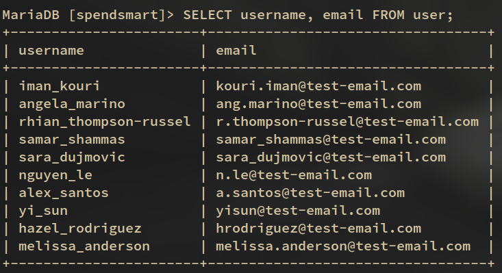
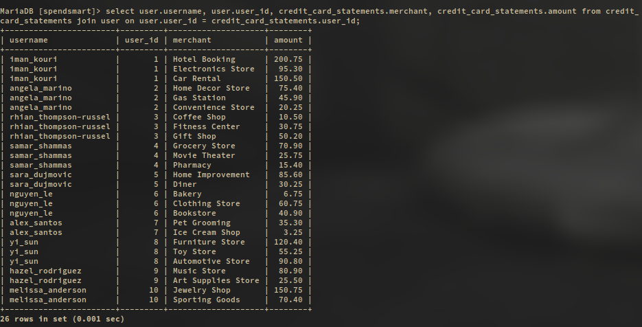
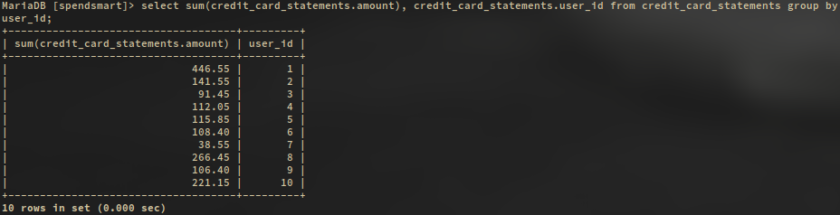
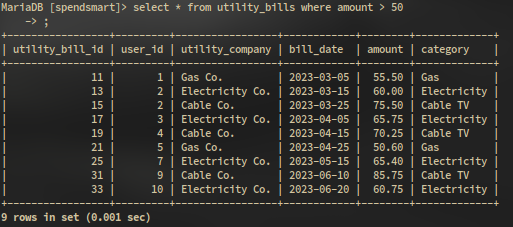
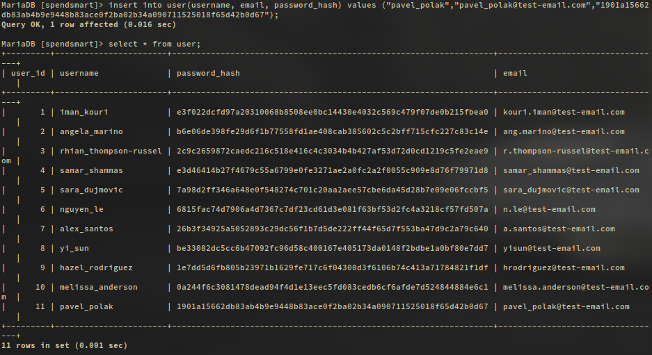
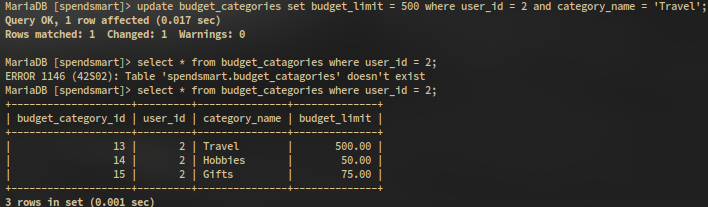
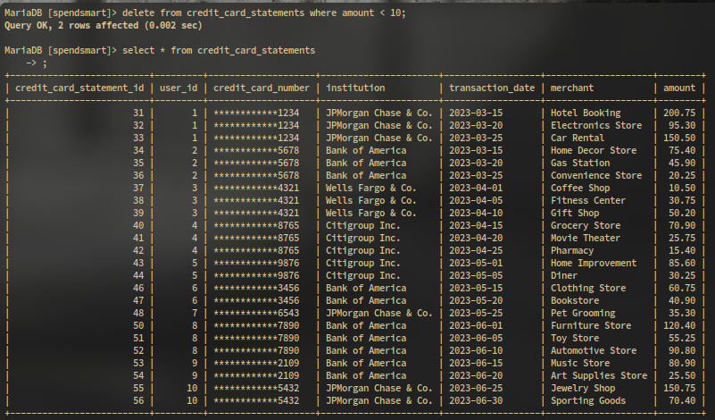
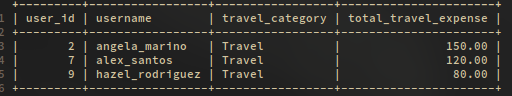
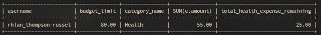

# SQL Assignment Report

## SQL Queries:

```sql

```



```sql

```


```sql

```



```sql

```



```sql

```



```sql

```



```sql

```



```sql

```



```sql

```



```sql

```



```sql

```


