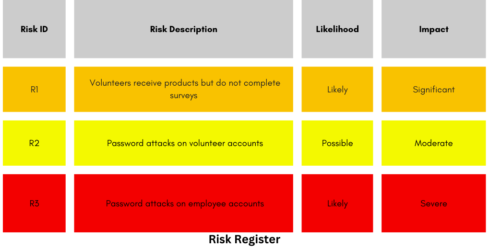
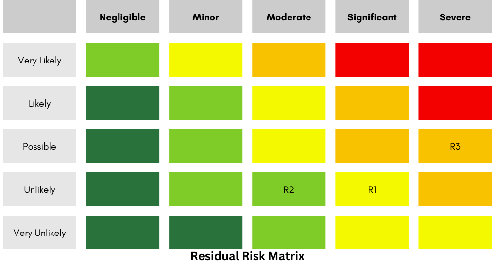

# Research Matters International

#### Table of Contents:

- [Company Brief](#company-brief)
- [RMI New Initiative](#rmi-new-initiative)
- [Platform Expansion](#platform-expansion)
- [incident Response Plan](#incident-response-plan)
- [Business Response Plan](#business-response-plan)

## Company Brief

Research Matters International (RMI) is a leading international marketing
research firm that conducts market research on new product launches for
clients. They have a strong presence in Canada, the US and Europe with 30 local
offices. RMI hosts in-person focus groups to gather data on volunteer reactions
to new products, which is provided to customers to improve their offerings. RMI
works with 50-100 large and midsize companies annually, generating $50k-$75k
per engagement. Last year RMI's revenue exceeded $8 million. RMI's most
valuable asset is its proprietary historical research data, valued at over $5
million, which is stored on internal servers.

## Risk Identification, Impact and Analysis

| Risk | Impact | Likelihood | Analysis |
|-|-|-|-|
| Data theft/leakage | High | Moderate | RMI's historical research data is their most valuable asset and protection should be prioritized |
| Data loss | High | Low-Moderate | Maintain integrity of data and ensure that it is not accidentally deleted or damaged |
| Email phishing | Moderate | Moderate | Previlent attack vector to comprimise accounts |
| Insider threat | Moderate | Low | Disgruntled employees could intentionally leak or damage data |
| Ransomware | High | Low | Could result in loss of data and availability |
| DDoS | Moderate | Low | Service disruption |

- Since RMI operates in Canada, US and Europe, they would likely need to comply with regulations like GDPR, CCPA, PIPEDA, and various US state laws regarding data privacy and security.

## Risk Assessment

The highest risks to RMI are:

- Data theft/leakage - If customer data was stolen or leaked, it could severely damage RMI's reputation and lead to loss of business. Remediation costs could also be very high.
- Data loss - If critical RMI data is lost due to hardware failure, accidental deletion, or ransomware, it could significantly disrupt operations. Data backups and recovery plans are essential.
- Ransomware - A successful ransomware attack could encrypt important data and systems, disrupting operations. RMI may have to pay a large ransom to regain access.

Moderate risks that should not be ignored:

- Email phishing - Phishing attacks could trick employees into revealing passwords or downloading malware. Employee security training is needed.
- Insider threats - Malicious insiders with access to sensitive data and systems pose a constant risk. Access controls and monitoring can help mitigate this.

Lower priority but still potential risks:

- DDoS attacks - Could disrupt customer-facing systems and websites, though redundancy and mitigation services could minimize impact.
- Compliance - Failing to comply with data protection regulations like GDPR could lead to heavy fines. Policies and auditing are needed to avoid this.

## Risk Assessment

Data theft/leakage, data loss, and ransomware present the highest risk to RMI
due to their potentially severe impacts on RMI's most important asset. Email
phishing and insider threats are moderate risks that should not be ignored.
DDoS attacks are less likely but could still disrupt operations. Compliance
with data regulations is also an important consideration.

## Mitigation Recommendations

- Implement robust access controls and encryption to protect sensitive data
- Regularly back up data and test restoration procedures
- Provide security awareness training for staff
- Endpoint protection including EDR, IPS, IDS, and firewalls
- Email security solutions to filter malicious emails and attachments such as DMARC (Domain-based Message Authentication, Reporting, and Conformance)
- Monitor systems and networks to detect threats and unauthorized access attempts with robust logging
- Create and update incident response plans for security events
- Review and comply with relevant data protection laws and regulations

# RMI New Initiative

The key risks identified with the new online volunteer survey platform are:

- Volunteers not completing feedback sessions after receiving products, resulting in lost costs
- Password attacks on volunteer accounts compromising payment details, address info, and private opinions
- Password attacks on employee accounts compromising confidential survey data

A risk assessment should be conducted focusing on volunteer accountability, password security, and data protection. Strong authentication methods, access controls, encryption, and cybersecurity awareness training should be implemented to mitigate risks. Ongoing monitoring and auditing will also be critical to identify and respond to any issues.

## Risk Register

## Risk Matrix

## Risk Analysis

- Prioritize preventing password attacks on employees due to the severe impact
- Uncompleted surveys may impact revenue and should be mitigated
- Password attacks on volunteers is possible but may be an acceptable risk to take

## Risk Mitigation Recommendations

- Enforce strong password policies and multi-factor authentication for employees.
  - Limit employee data access with least privilege.
  - Encrypt data at rest and in transit.
- Require volunteers to provide partial payment upfront before sending products.
  - Follow up quickly with volunteers that miss sessions.
- Enforce strong password policies for volunteers.
  - Implement multi-factor authentication.
  - Monitor for suspicious activity.

## Residual Risk Assessment

If the above mitigations were implemented:

- Volunteers receive products but do not complete surveys likelihood is reduced to unlikely. Residual risk is reduced to medium.
- Password attacks on volunteer accounts impact is reduced to unlikely. Residual risk lowered to Low.
- Password attacks on employee accounts impact is reduced to possible. Residual risk lowered to Medium High.

## Conclusion

A qualitative assessment is appropriate for now. With data on past loss events and security control effectiveness estimates, a quantitative assessment could be done.

# Platform Expansion

The online research platform created by Research Matters International has been successful so far. However, plans to expand access to suppliers increases risks around password security and survey completion rates. If not properly addressed, these issues could erode supplier confidence and hurt profits.

To manage the risks associated with expanding the research platform to suppliers follow these recommendations.

## Strategic Priorities

- Grow number of volunteers and suppliers on the platform
- Maintain trust and confidence of all users

To balance these priorities, RMI should focus on:

- Robust identity and access management
- Ongoing security awareness training
- Proactive monitoring and response

## Key Performance Indicators

- Password attack rate
  - Monitor the number of unsuccessful login attempts to identify brute force password attacks and suspicious activity.
- Survey completion rate
  - Track the percentage of users who start a survey and complete it.
- Customer satisfaction
  - Regularly survey suppliers on their satisfaction with the platform.
- Revenue impact
  - Monitor revenue and margins to understand impact of the platform expansion.
- Incident response readiness
  - Ensure a formal incident response plan is in place to respond quickly to security events and regularly test the plan.

## Key Risk Indicators

- Increased rate of new user sign-ups
  - Large upticks may indicate exploitation of the platform
- Sudden changes in survey completion rates
  - This could be the result of bots and should be monitored
- Uptick in password reset requests
  - May indicate password compromise
- Reports of suspicious activity from users
  - Important in identifying phishing attacks

## Thresholds

- New user sign-ups exceeding 10% week-over-week
- Survey completion rates dropping below 80%
- More than 50 password resets per day

## Tighter Controls

- Implement CAPTCHA on sign-up forms to prevent automated bot sign-ups.
- Enforce stronger passphrase policies requiring a minimum length, mix of characters, and periodic resets to prevent easy guessing.
- Limit failed login attempts before lockout to prevent brute force attacks. Start with 3-5 failed attempts triggering a temporary lockout.
- Deploy multi-factor authentication using a secondary method like SMS or authenticator apps for additional identity verification on logins.
- Implement principle of least privilege access controls, granting employees minimum necessary access.
- Log and monitor access attempts to sensitive systems. Alert on anomalies.
- Encrypt sensitive data at rest and in transit to prevent unauthorized access.
- Perform regular external vulnerability scans and address any critical issues.
- Provide security awareness training to employees on threats and best practices.

## Risk Management Rating

Overall, I would rate RMI's risk management capability as Moderate. They have shown commitment to security but will need to mature their practices to manage the increased risks from expansion. Specific areas for improvement include:

- Formalizing an enterprise risk management program
- Developing a cybersecurity incident response plan
- Increasing security tooling and automation
- Hiring dedicated cybersecurity staff
- Conducting regular pen testing and vulnerability scans

With focused effort on security practices, RMI can successfully expand while safeguarding trust in the platform.

# Incident Response Plan

## Executive Summary

The online system is critical infrastructure for the organization's operations and revenue. A disruption due to a cyberattack like ransomware or DDoS could be catastrophic. This incident response plan outlines procedures to quickly detect, contain, and recover from such an attack.

The key objectives of the plan are:

- Rapidly detect potential incidents through monitoring and alerts
- Contain impacts by isolating affected systems
- Eradicate threats by removing malware, disabling accounts
- Recover systems and data from backups
- Conduct forensic analysis to determine root cause
- Improve defenses to prevent similar incidents

With defined roles, actions, and tools, this plan will enable a swift and coordinated response to mitigate damage, restore services, communicate effectively, and resume normal operations after an attack.

## Detection Measures

- Network monitoring for abnormalities in traffic patterns
  - Monitor network traffic for unusual spikes in volume, strange connection patterns, or traffic to/from unexpected places which could indicate malicious activity
- Intrusion Detection System (IDS) and Intrusion Prevention System (IPS)
  - IDS/IPS systems analyze network traffic patterns to identify potential attacks and malicious activity
- Regular vulnerability scanning and penetration testing
  - Proactively scan systems and networks to identify vulnerabilities before they can be exploited
- Monitoring of critical system files for unauthorized changes
  - Track changes to important system files/configurations to detect tampering or malicious modifications
- User reports of system errors or abnormal behavior
  - Rely on user reports of odd errors or system behavior to identify potential incidents early

## Containment Measures

### Malware Infection

- Isolate infected systems from the network
- Disable affected user accounts
- Block suspicious domains at the firewall
- Take forensic image of infected systems

### Data Breach

- Disable compromised user accounts
- Reset user passwords as needed
- Revoke API keys/tokens for affected accounts
- Block exfiltration destinations at the firewall

### DDoS Attack

- Use firewall rules to block attack traffic
- Blackhole routing to drop attack traffic upstream
- Enable DDoS mitigation service if available
- Null route target IP addresses if needed

### Insider Threat

- Disable suspected user accounts
- Revoke access to sensitive systems
- Monitor user activities for unauthorized actions
- Image affected systems for forensic analysis

## Eradication and Recovery

- Wipe and rebuild affected systems from clean backups
- Install patches, update signatures and firewall rules
- Run antivirus scans to remove malware
- Require password resets for all user accounts
- Bring services and applications online one at a time after testing
- Review access controls and segmentation to prevent lateral movement
- Monitor systems for suspicious activity and further incidents

## Post Incident Activity

- Complete incident report with timeline, impact, and recommendations
- Review and update security controls to harden application
- Additional staff training on incident response procedures
- Test backups and restoration process
- Schedule tabletop exercise to practice response plan

# Business Response Plan

## Executive Summary

A cyberattack could disrupt online systems and prevent customers from accessing our platform. This business response plan outlines steps to maintain business operations and customer service during an incident.

## Detection Measures

- Customer complaints of errors accessing online platform
- Monitoring sales and revenue for unexpected drops
- IT notifications of system anomalies or attack detection

## Containment Measures

- Activate call center to field customer inquiries
- Post service status notifications on website/social media
- Halt marketing campaigns driving traffic to site
- Prepare press release and FAQ for public notification

## Recovery and Resilience

- **Recovery Time Objective (RTO):** The online system generates a substantial
  portion of the organization's income, therefore setting an aggressive RTO would
  be important. Aiming for an RTO of under an hour could be considered, depending
  the potential financial implications of extended downtime.

- **Recovery Point Objective (RPO):** Considering the importance of maintaining
  up-to-date information, a low RPO is advisable. Setting an RPO of less than an
  hour would minimize the data loss that can be accepted, allowing for the
  organization to quickly resume operations with up to date data once the threat
  has been neutralized.

### Enhancing Overall Resilience

In addition to the recovery time and point objectives above, the following measures will be taken to improve overall resilience:

- Implement a cybersecurity training program for all employees to reduce risk of phishing and social engineering attacks
- Migrate critical systems to cloud infrastructure for added redundancy and automated failover
- Establish an incident response plan and emergency communications protocol
- Conduct annual business continuity exercises to validate plan effectiveness
- Maintain spare capacity on critical infrastructure to handle unexpected surges in demand
- Provide regular updates to customers on service restoration
- Offer discounts or credits to affected customers
- Bring online systems back gradually as service is restored
- Confirm full functionality with test transactions

## Post Incident Activity

- Public notification that systems are fully restored
- Analysis of customer, revenue, and reputation impact
- Marketing campaign to restore customer trust
- Review legal obligations for breach disclosure
- Revise business continuity plans based on lessons learned

## Post Incident Review

- Schedule a post-incident review meeting with all stakeholders involved in the incident response
- Document timeline of events, decisions made, actions taken, and communications during the incident
- Identify areas of success and failure in the incident response
- Capture lessons learned, improvement opportunities, and corrective actions
- Update incident response procedures and continuity plans based on review findings
- Develop plans and timelines for implementing improvements
- Communicate results of review to executive leadership
- Conduct periodic reviews of improvements and provide status updates

