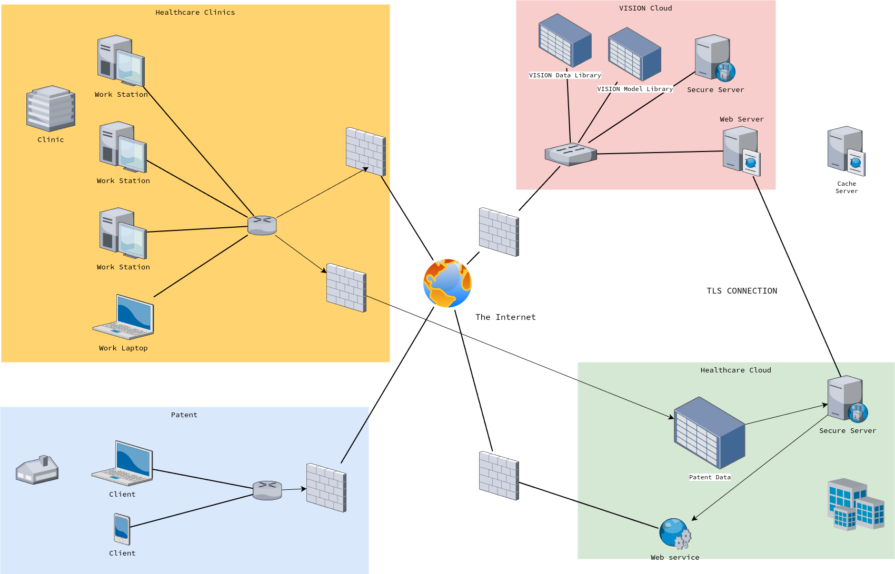
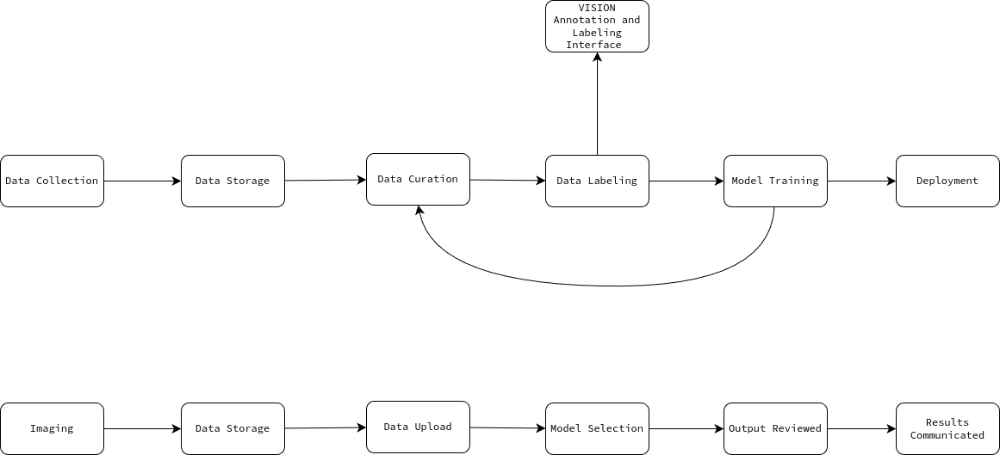

# 

    
Network and Data Security

    
Liam Dodd

    
April 8, 2024

Develop a network topology diagram that would be required to support the chosen processes. A network topology diagram helps in identifying potential vulnerabilities in the network structure.

Deliverable: Write a Network and Data Security Report

# Executive Summary: A summarized overview of the network and data security analysis, suitable for executives.

The network and data security analysis identified several areas for improvement to strengthen protections and reduce risk:

- Implement multi-factor authentication for all user accounts to prevent unauthorized access. Require strong passwords and enforce regular password changes.

- Deploy next-generation firewalls and intrusion detection/prevention systems to monitor network traffic, block malicious activity, and alert on anomalies. Keep all security software up-to-date.

- Encrypt sensitive data in transit and at rest. Ensure proper key management procedures.

- Institute least privilege and separation of duties access controls. Limit users to only the systems and data necessary for their role.

- Perform regular vulnerability scanning and penetration testing to identify and remediate vulnerabilities before they can be exploited.

- Implement a security information and event management (SIEM) system for log collection, correlation, and alerting on suspicious activity. Monitor the SIEM.

- Provide ongoing security awareness training to educate employees on cyber risks, phishing, and other threats. Test employees with simulated phishing emails.

- Develop an incident response plan with defined procedures for detecting, responding to, and recovering from security incidents. Conduct response exercises.

- Back up critical data regularly. Store backups offline and encrypted. Test restoration.

- Consider cyber insurance to help offset costs of breach response, legal services, fines, and damages.

Implementing these best practices will improve the organization's security posture against modern cyber threats, preventing breaches and reducing potential impacts. Ongoing training, testing, and adaptation to the evolving threat landscape are essential.

# Data & Network Architecture

## Current Architecture

## Data Flow

# Security Concerns: Identification and discussion of specific security concerns within the network and data architecture.

1. Secure Data Transfer:

   - Concern: Transferring sensitive medical data between the client's systems and VISION's cloud infrastructure poses risks of data interception, tampering, or unauthorized access.
   - Recommendation: Implement secure, encrypted communication channels (e.g., VPN, SSL/TLS) for all data transfers. Use strong encryption algorithms and properly manage encryption keys to ensure data confidentiality and integrity during transit.

1. Data Storage and Access Control:

   - Concern: Storing patient data in the cloud raises concerns about data privacy, unauthorized access, and compliance with regulations such as HIPAA (Health Insurance Portability and Accountability Act).
   - Recommendation: Employ robust access control mechanisms, such as role-based access control (RBAC), to ensure that only authorized personnel can access patient data. Implement strong authentication methods (e.g., multi-factor authentication) and regularly review and update access permissions.

1. Data Retention and Disposal:

   - Concern: Retaining patient data longer than necessary or not properly disposing of it can lead to privacy breaches and non-compliance with regulations.
   - Recommendation: Establish clear data retention policies that align with legal and regulatory requirements. Securely dispose of data when it is no longer needed, using methods like secure deletion or data anonymization.

1. Compliance with Medical and Technology Regulations:

   - Concern: Processing and storing medical data is subject to various regulations, such as HIPAA, which impose strict requirements on data privacy, security, and handling.
   - Recommendation: Conduct a thorough assessment of applicable regulations and ensure that VISION's systems and processes are compliant. This may involve implementing specific security controls, conducting regular audits, and maintaining documentation to demonstrate compliance.

1. Secure Communication of Results:

   - Concern: Communicating results to clients, patients, insurance companies, and other healthcare providers requires ensuring the confidentiality and integrity of the information.
   - Recommendation: Use secure communication channels, such as encrypted email or secure messaging platforms, to transmit results. Implement strong authentication mechanisms to verify the identity of recipients before sharing sensitive information.

1. Data Segregation and Isolation:

   - Concern: Mixing client data with VISION's internal systems or using it for model training without proper controls can lead to data leakage and privacy concerns.
   - Recommendation: Implement strict data segregation measures to keep client data separate from VISION's internal systems. If client data is used for model training, ensure that it is properly anonymized or de-identified to protect patient privacy.

1. Third-Party Risk Management:

   - Concern: Relying on vendors, contractors, and external teams (e.g., the cybersecurity monitoring team in India) introduces additional security risks.
   - Recommendation: Conduct thorough due diligence on all third parties involved in the project. Establish clear security requirements in contracts and regularly assess their compliance. Implement secure remote access solutions and monitor third-party activities.

1. Incident Response and Disaster Recovery:

   - Concern: Cybersecurity incidents or system failures can disrupt operations and compromise data integrity.
   - Recommendation: Develop and regularly test incident response and disaster recovery plans specific to the healthcare client's project. Ensure that there are clear procedures for detecting, containing, and recovering from security incidents or system outages.

It's important to note that these are high-level recommendations based on the provided information. A comprehensive security assessment should be conducted to identify and address all potential risks and vulnerabilities specific to VISION's infrastructure and the healthcare client's requirements. Regular security audits, penetration testing, and employee training should also be part of the ongoing security program.

# Process-Driven Solution: Solutions and strategies based on the security concerns. Don’t forget to include vulnerability management, penetration testing, logging & monitoring, and threat intelligence as part of your solution.

# Process-Driven Solution:

## Vulnerability Management

- Perform regular vulnerability scans on all systems and infrastructure using tools like Nessus. Remediate any critical or high severity vulnerabilities.
- Subscribe to vulnerability mailing lists like US-CERT to stay up to date on new vulnerabilities.
- Patch systems regularly, prioritizing based on severity and exploitability of vulnerabilities.

## Penetration Testing

- Conduct annual penetration tests on all external facing systems and infrastructure.
- Perform internal penetration tests at least every 2 years.
- Remediate all findings from pentests based on severity and exploitability.

## Logging & Monitoring

- Send logs from all systems to a central SIEM for analysis and correlation.
- Monitor logs and alerts for anomalous activity that could indicate compromise.
- Enable file integrity monitoring on critical systems.

## Threat Intelligence

- Subscribe to threat intel feeds that provide IOCs and context on new/emerging threats.
- Incorporate IOCs from threat intel into IDS/IPS and SIEM to detect known bad actors.
- Perform lookups against threat intel when investigating potential incidents.

# Recommendations: Strategic advice for enhancing network and data security.

# Recommendations

Here are some recommendations for enhancing your organization's network and data security:

## Implement strong access controls

- Require strong passwords and enable multi-factor authentication for all users.
- Limit access to sensitive data and systems to only those who need it.
- Implement the principle of least privilege.

## Keep systems and software up-to-date

- Maintain up-to-date operating systems, software, and security patches on all devices.
- Automate patch management processes to ensure timely patching.
- Replace end-of-life systems that are no longer supported.

## Secure the network perimeter

- Use firewalls to limit traffic between network zones and filter out malicious traffic.
- Disable remote access to devices that don't require it.
- Implement VPNs for secure remote access into your network when needed.

## Encrypt sensitive data

- Encrypt data in transit and at rest wherever possible.
- Enforce encryption policies through technology controls.
- Properly manage and store encryption keys.

## Monitor, log, and analyze activity

- Implement security information and event management (SIEM) solutions.
- Log and monitor user and system activity to identify anomalies.
- Perform penetration tests and vulnerability scans regularly.

## Provide security training

- Educate employees on cybersecurity best practices through training and simulated phishing tests.
- Ensure security policies are clearly communicated.

## Maintain backups and incident response plans

- Regularly back up critical data with both onsite and offsite storage.
- Develop and test incident response plans for security events.

## Work with qualified security partners

- Leverage qualified vendors like managed security service providers.
- Obtain regular guidance from qualified cybersecurity consultants.

# Conclusion: Final assessment and overarching implications for network and data security

The analysis of VISION's network and data security for the healthcare client project reveals several critical areas that require attention and improvement. The current architecture and data flow present vulnerabilities that could potentially lead to data breaches, non-compliance with regulations, and reputational damage.

To mitigate these risks, VISION must prioritize the implementation of robust security measures across the entire infrastructure. This includes securing data transfer channels, enforcing strong access controls, ensuring compliance with medical and technology regulations, and properly managing data retention and disposal.

Furthermore, VISION should adopt a proactive approach to security by conducting regular vulnerability assessments, penetration testing, and security audits. Implementing a comprehensive logging and monitoring system, along with threat intelligence capabilities, will enable the timely detection and response to potential security incidents.

Collaboration with trusted third parties, such as the cybersecurity monitoring team in India, should be governed by strict security requirements and regular compliance assessments. VISION must also develop and test incident response and disaster recovery plans to minimize the impact of any security breaches or system failures.

Investing in ongoing security training for employees is crucial to foster a culture of security awareness and reduce the risk of human error. Regular training and simulated phishing exercises will help employees identify and report potential threats.

By addressing these security concerns and implementing the recommended solutions, VISION can strengthen its network and data security posture. This will not only protect sensitive patient data and maintain the trust of the healthcare client but also position VISION as a reliable and secure partner in the healthcare industry.

However, it is important to note that security is an ongoing process. As threats evolve and new vulnerabilities emerge, VISION must continuously assess and adapt its security strategies. Regular reviews, updates, and improvements to the security infrastructure are essential to stay ahead of potential risks.

In conclusion, prioritizing network and data security is not only a technical necessity but also a strategic imperative for VISION's success in the healthcare sector. By implementing robust security measures, fostering a culture of security awareness, and maintaining a proactive approach to risk management, VISION can ensure the confidentiality, integrity, and availability of sensitive data while building long-term trust with its clients.
