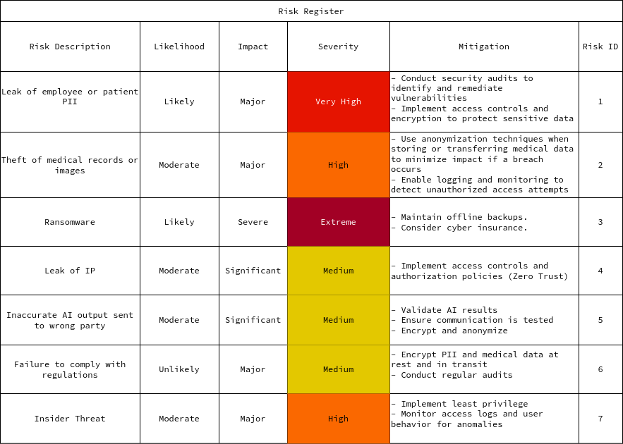

    
Cybersecurity Risk Assessment: VISION

    
Liam Dodd

    
April 8, 2024

# People, Processes, and Technology

Next identify the people, and technology supporting the processes identified. It is important to recognize these elements to understand the ecosystem where cybersecurity measures will be applied.

# Executive Summary

- Our most critical assets are patient data, intellectual property, and systems that support core operations.
- Key strategic risks involve theft of IP, legal issues around data usage, and damage to reputation.
- Top financial risks include cybercrime, fines, lawsuits, and ransomware.
- Major operational risks stem from cyber attacks, IP theft, insider threats, and vendor issues.
- Compliance risks center on regulatory requirements for PII/medical data and AI/algorithms.
- Third party risks involve breaches via clients, vendors, and contractors.
- Core data risks relate to leaks of PII and medical data, inaccurate AI output.
- Recommend focusing risk management on strengthening data security, incident response, insider threat detection, vendor oversight, and compliance auditing.

## People

**VISION**

- 200 Bay Area Employees

- Numerous vendors and contractors

  - maintenance
  - infrastructure

- 24h cybersecurity monitoring team in India

**Client**

- 60,000 employees globally

- Technicians, nurses, doctors, admin staff, etc.

- Dedicated lab facilities, but also clinics within
  partner organizations such as pharmacy and grocery chains.

## Technology

- VISION must maintain highly efficient infrastructure that remains secure but accessible
- VISION Cloud infrastructure for model library and AI training interface
- The client has their own dedicated cloud environment
- The client provides a patient facing web app

# Data Flow

# High Impact Risk Overview

Detailed analysis of the most significant risks identified during the risk assessment.

# Asset List

## Company Assets

- Employee data (PII, credentials, etc.)
- Intellectual property (algorithms, models, code, etc.)
- Physical assets (servers, computers, office equipment)
- Vendor/contractor data
- Financial data

## Client Assets

- Patient data (PII, medical records, imaging, etc.)
- Employee data
- Physical assets (servers, computers, medical equipment)
- Financial data

# Risk Register

## Strategic Risks

- Competitors stealing IPBriefly elaborate on what you want to discuss.
- Legal issues around data sourcing/usage (Copyright)
- Failure to innovate and keep pace with competition
- Damage to reputation from security breach

## Financial Risks

- Theft of funds via cybercrime
- Fines for regulatory non-compliance
- Lawsuits from data breaches

## Operational Risks

- Service disruption from DDoS, ransomware, or other cyber attacks
- Leak of intellectual property
- Insider threat from malicious employee or contractor
- Vendor management issues leading to breach

## Compliance Risks

- Failing to meet regulatory requirements around PII and medical data
- Violating laws around AI/algorithm usage
- Non-compliance with medical device standardsBriefly elaborate on what you want to discuss.

## Third Party Risks

- Breach of client systems leading to breach of company systems
- Vendor negligence leads to breach of company systems
- Contractors mishandle sensitive data

## Data Risks

- Leak of employee or patient PII
- Theft of medical records or images
- Inaccurate AI output sent to wrong party

# Recommendations

## Data Privacy and Compliance

- Healthcare data is highly sensitive and there are strict regulations around its use, storage, and transmission.
  - Need to comply with regulations like HIPAA, GDPR, etc.
- Only collect, process, and store minimum necessary data.
  - Delete when no longer needed.
- Encrypt data in transit and at rest.
  - Use TLS for connections.
- Get legal signoff on data processing activities.
- Implement access controls and auditing to track data access.

## Secure Architecture

- Isolate client data from VISION systems.
  - Use separate cloud environments.
- Authenticate connections between VISION and client systems.
- No caching of client data in VISION systems unless absolutely necessary.

## Operations Security

- Harden cloud environments, VMs, containers, etc.
- Continuously monitor for threats, attacks, or unauthorized access.
- Perform penetration testing and code audits regularly.
- Have an incident response plan ready in case of a breach.

## AI Model Training

- Carefully manage training data.
- Check for bias in training data and model outputs.
- Continuously evaluate model performance on diverse datasets.
- Have human oversight on model outputs before clinical use.

## Secure Communications

- Encrypt all data transfers externally.
- Authenticate recipients before sending data.
- Carefully manage credentials and API keys.
  - Rotate periodically.
- Notify patients/doctors if incorrect results are sent out.

## Endpoints and Accounts

- Enforce MFA for all user and admin accounts.
  - Explore SSO and Passkey authentication.
- Use least privilege model for user roles and access.
- Automatically lock accounts after periods of inactivity.
- Patch and secure all client endpoints and apps.

## Physical Security

- Secure physical facilities where data is processed and stored.
- Dispose of old equipment and media securely.

## Business Continuity

- Have redundancy for critical systems.
- Regularly backup data and configurations.
- Test disaster recovery procedures periodically.

# Conclusion

This cybersecurity risk assessment provides a comprehensive overview of
VISION's security posture, identifying key assets, data flows, risks, and
recommendations to strengthen protections.

The most critical assets are patient data, intellectual property, and systems
supporting core operations. Strategic risks center around theft of IP and
damage to reputation. Major financial and operational risks stem from cyber
attacks, data breaches, and non-compliance.

Key recommendations include:

- Strengthening data privacy protections and compliance with healthcare regulations
- Isolating client data environments from VISION systems
- Hardening cloud infrastructure and continuously monitoring for threats
- Securing AI model training pipelines and outputs
- Encrypting data transfers and authenticating recipients
- Enforcing MFA and least privilege access controls
- Physical security for facilities and proper disposal of old equipment
- Business continuity through redundancy, backups, and disaster recovery testing

By implementing these security measures, VISION can effectively manage its
cyber risk exposure, safeguard critical assets, and ensure the confidentiality,
integrity, and availability of systems and data. Ongoing security awareness and
testing will be vital to keep pace with an evolving threat landscape.
