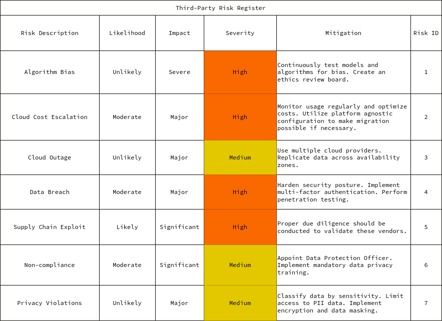

    
Third-Party Risk

    
Liam Dodd

    
April 8, 2024

# Third-Party Risk Assessment for VISION

## Executive Summary

This report provides a comprehensive third-party risk assessment for VISION
Corporation. It identifies key risks associated with third-party vendors and
services and provides mitigation strategies.

The scope includes an evaluation of strategic, financial, operational,
compliance, data privacy, vendor, supply chain, and business continuity risks.
A shared responsibility model is proposed to delineate security obligations
between VISION and its cloud providers.

Proper third-party risk management is crucial for VISION to maintain regulatory
compliance, protect sensitive data, ensure business continuity, and minimize
financial, legal, and reputational exposure. This report provides actionable
insights to help VISION make informed risk decisions regarding third-party
relationships.

Ongoing monitoring and governance of third-party risks is recommended through
mechanisms like risk registers, vendor assessments, and contract terms. With
appropriate risk mitigation and oversight, VISION can strategically leverage
third-parties to enable innovation and growth.

## Third-Party Risk Register

### Strategic Risks

- **Risk:** VISION's AI and algorithms may demonstrate bias and unfairness towards certain groups, resulting in legal liability and reputation damage.

  - **Mitigation:** Continuously test models and algorithms for bias. Create an ethics review board.

- **Risk:** Competitors may develop superior AI technology, eroding VISION's market position.

  - **Mitigation:** Invest heavily in R&D and recruit top AI talent. Pursue strategic acquisitions.

### Financial Risks

- **Risk:** Cloud costs may escalate rapidly as data storage and computing needs increase.

  - **Mitigation:** Monitor usage regularly and optimize costs. Utilize platform agnostic configuration to make migration possible if necessary.

### Operational Risks

- **Risk:** Prolonged outage at cloud providers disrupts services and causes data loss.

  - **Mitigation:** Use multiple cloud providers. Replicate data across availability zones.

- **Risk:** A cyber attack results in data breach and theft of intellectual property.

  - **Mitigation:** Harden security posture. Implement multi-factor authentication. Perform penetration testing.

- **Risk:** Key employees leave the company, resulting in loss of critical knowledge.

  - **Mitigation:** Incentivize retention with stock options. Cross-train employees. Document processes thoroughly.

### Compliance Risks

- **Risk:** Non-compliance with GDPR results in heavy fines.

  - **Mitigation:** Appoint Data Protection Officer. Implement mandatory data privacy training.

- **Risk:** Lax controls around PII data leads to privacy violations.

  - **Mitigation:** Classify data by sensitivity. Limit access to PII data. Implement encryption and data masking.

### Vendor and Supply Chain Risks

- **Risk:** Reliance on many third-party vendors for services like cleaning, food, accounting etc.

  - **Mitigation:** Proper due diligence should be conducted to validate these vendors.

- **Risk:** An overseas cybersecurity monitoring team. There are risks of data exfiltration and lack of visibility into their activities.

- **Risk:** No vendor risk management program to assess and monitor third-party vendors on an ongoing basis.

### Business Continuity Risks

- **Risk:** VISION is highly dependent on its IT infrastructure and cloud providers. Any outages could significantly impact operations.

- **Risk:** Reliance on any single vendor or system.

  - **Mitigation:** Redundancy built into critical systems and a tested business continuity plan.

## Shared Responsibility Model

The shared responsibility model defines the division of responsibilities between cloud providers and customers when using cloud services. It helps understand security and compliance obligations for both parties.

### Key Points

- In cloud computing, responsibilities for security and compliance are shared between the cloud provider and the customer. The division depends on the service model used.

- In SaaS (Software as a Service), the provider manages most aspects of the application and infrastructure. The customer is responsible for their data, user access, and application-level security.

- In IaaS (Infrastructure as a Service), the provider manages the physical infrastructure and virtualization. The customer handles OS, network, data, and application security.

- In PaaS (Platform as a Service), the provider manages the infrastructure, OS, and middleware. The customer is responsible for the deployed apps and data security.

- Understanding the shared model is crucial to set up proper security controls, meet compliance needs, and determine liability in case of a breach or outage.

- The shared responsibility model creates interdependence between the provider and customer. Close cooperation is needed to ensure end-to-end security.

## Risk Management Strategies

Third-party vendors and service providers play a crucial role in our business
operations. However, engaging third-parties also exposes us to significant
risks that need to be managed. This report summarizes the key risks associated
with our third-party relationships and provides risk mitigation strategies.

### Risk Assessment

We have identified the following key risk areas when engaging third-parties:

#### Strategic Risks

- Over-reliance on a small number of vendors, resulting in concentration risk
- Vendors gaining access to sensitive IP or capabilities, increasing competitive risk

#### Financial Risks

- Vendors going bankrupt or ceasing operations, leading to service disruption
- Vendors failing to meet service levels, resulting in penalties or lost revenue

#### Operational Risks

- Vendors mishandling sensitive data, causing data breaches
- Vendors experiencing outages, interrupting business operations
- Vendors using substandard quality components, impacting product quality

#### Compliance Risks

- Vendors violating laws or regulations, leading to fines or litigation
- Vendors lacking adequate controls around data privacy or security

### Risk Mitigation Strategies

To mitigate third-party risks, we recommend the following strategies:

- Establish a vendor risk management program for due diligence and monitoring
- Include service level agreements (SLAs) and security requirements in contracts
- Conduct regular vendor audits and site visits
- Maintain business continuity plans for vendor failure scenarios
- Require cyber insurance coverage for vendors handling sensitive data
- Diversify vendors to avoid concentration risk
- Implement controls like encryption for data shared with vendors

## Conclusion

This report provides a comprehensive assessment of the key risks associated
with third-party vendors and service providers at VISION Corporation. Proper
oversight and management of third-party relationships is crucial for reducing
the organization's exposure to strategic, financial, operational, compliance,
data privacy, supply chain, and business continuity risks.

By implementing a robust vendor risk management program, VISION can
continuously monitor and evaluate risks posed by vendors. Ongoing due
diligence, audits, contract terms, and security controls are vital for
mitigating third-party risks.

As VISION adopts cloud computing and other third-party services, it is
essential to have a clear understanding of the shared responsibility model.
VISION must fulfill its obligations around data security, access controls, and
compliance in the cloud.

With appropriate governance and risk mitigation strategies, VISION can securely
leverage third-parties to create business value and enable innovation. However,
third-party relationships must be built on a foundation of trust and risk
transparency between the parties involved.

This report provides VISION with actionable insights into current third-party
risks and how to reduce exposure going forward. But third-party risk management
must be an ongoing process, adapting to new partnerships and evolving business
needs. Regular communication, contract review, and risk assessments will
strengthen VISION's vendor relationships while protecting the organization.
