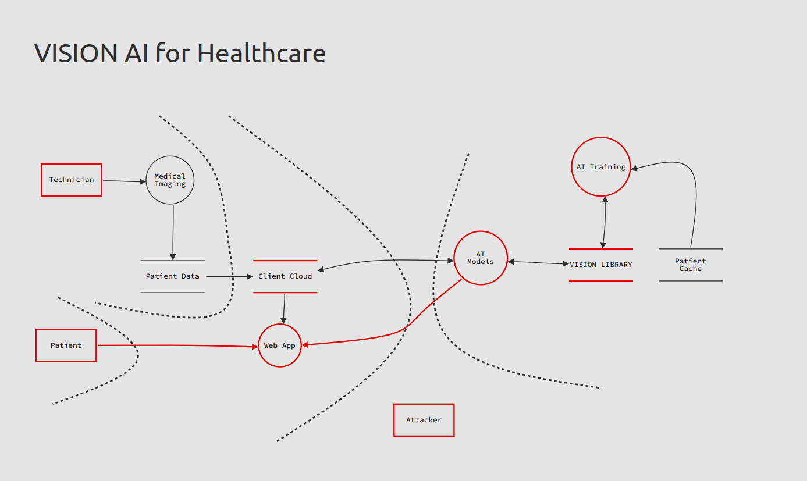

    
Threat Modeling

    
Liam Dodd

    
April 8, 2024

# Executive Summary

This threat modeling report identifies potential security threats to the
computer vision system under development and suggests mitigations to address
them. Key threats include spoofing of credentials or data, tampering with
training data or models, denial of service attacks, and unauthorized access due
to misconfiguration. Implementing authentication, encryption, immutable
storage, audit logging, and access controls are highlighted as key mitigations.
Ongoing threat modeling as the system architecture evolves is recommended.

# Threat Modeling Overview

The STRIDE methodology was used to categorize threats for the computer vision
system. STRIDE stands for Spoofing, Tampering, Repudiation, Information
Disclosure, Denial of Service, and Elevation of Privilege. Each component of
the system architecture was analyzed in the context of how it could be
threatened in each of these categories. Potential mitigations were proposed for
the identified threats.

# Threat Model

This document outlines potential threats and mitigations for the computer vision system being developed by VISION for the healthcare client using the STRIDE methodology.

## Spoofing Threats

- An attacker could spoof login credentials to gain unauthorized access to patient data or system functions.

  - Mitigation: Implement multi-factor authentication for all user accounts.

- An attacker could spoof the origin of malicious data sent to the AI model for training.

  - Mitigation: Authenticate all connections to the training data pipeline. Verify the source of all training data.

- An attacker could spoof system components to intercept or alter data.

  - Mitigation: Encrypt all data in transit and at rest. Authenticate all internal system connections.

## Tampering Threats

- An attacker could alter training data to degrade model accuracy.

  - Mitigation: Store training data in an immutable, append-only data store.

- An attacker could modify system logs or alerts to cover their tracks.

  - Mitigation: Send logs to a SIEM in real-time. Alert on log tampering.

- An attacker could modify model parameters or outputs.

  - Mitigation: Store models in an immutable data store. Alert on unexpected changes.

## Repudiation Threats

- Users could deny having accessed patient data.

  - Mitigation: Implement detailed audit logging for all data access.

- Actions taken by the system could be denied later.

  - Mitigation: Immutable and detailed logging of all system actions.

## Information Disclosure Threats

- Patient data could be exposed in transit over the network.

  - Mitigation: Encrypt all connections with TLS.

- Patient data could be exposed due to misconfigured storage permissions.

  - Mitigation: Implement least privilege permissions on all data.

- Credentials or API keys could be exposed.

  - Mitigation: Store secrets in a secrets vault with limited access.

## Denial of Service Threats

- Attackers could flood the API with requests.

  - Mitigation: Implement rate limiting on the API.

- Attackers could consume all training compute resources.

  - Mitigation: Enforce resource quotas per user.

- The AI system could be overwhelmed with invalid data.

  - Mitigation: Input validation and anomaly detection.

## Elevation of Privilege Threats

- A user could escalate privileges through compromised credentials.

  - Mitigation: Enforce role-based access control. Rotate credentials regularly.

- An attacker could exploit a vulnerability to gain system access.

  - Mitigation: Harden systems and keep software patched and updated.

- Weak permissions could allow unauthorized data access.

  - Mitigation: Implement least privilege permissions.

This covers some high level threats and mitigations to consider. Further
analysis should be performed once system architecture and components are
finalized. Threat modeling is an iterative process that should be repeated as
the system evolves.

# Recommendations

Based on the threats identified through the STRIDE analysis, we recommend the following security improvements:

**Authentication and Access Controls**

- Implement multi-factor authentication for all user and system accounts to prevent spoofing.
- Enforce principle of least privilege through role-based access controls.
- Rotate credentials regularly to limit impact of compromises.

**Network Security**

- Encrypt all network traffic with TLS to prevent data exposure.
- Authenticate all connections internally to prevent spoofing.
- Implement firewall rules and network segmentation to limit access.

**Data Security**

- Encrypt data in transit and at rest to prevent exposure.
- Use immutable and append-only data stores for sensitive data like models and training data.
- Implement robust logging and monitoring to detect tampering.

**System Hardening**

- Harden systems by removing unnecessary services, closing open ports, and keeping software patched.
- Implement intrusion detection and prevention systems to detect attacks.
- Perform regular vulnerability assessments and penetration testing.

**Incident Response**

- Develop an incident response plan for security events.
- Send logs to a centralized SIEM for analysis and alerts.
- Have processes to isolate and recover from compromise.

# Conclusion

The threat modeling analysis identified areas where additional security
controls should be implemented to reduce risk, particularly around access
management, network security, and data protection. Implementing the recommended
mitigation strategies will improve the security posture against potential
attacks. However, threat modeling is an ongoing process. As the system
architecture and design evolves, additional analysis should be performed to
identify new threats and reevaluate risks.
